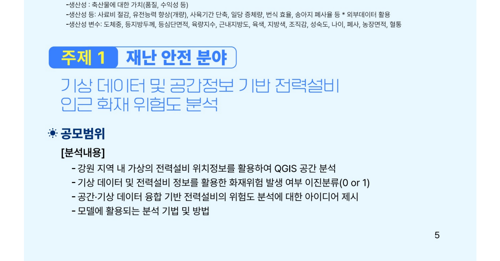
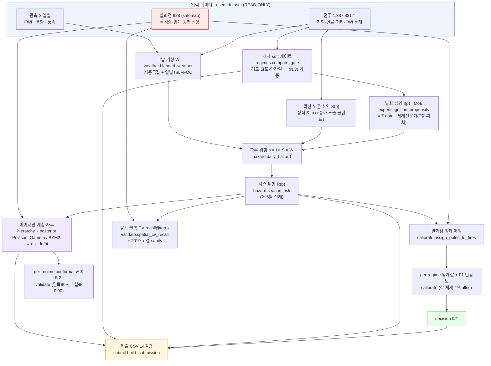
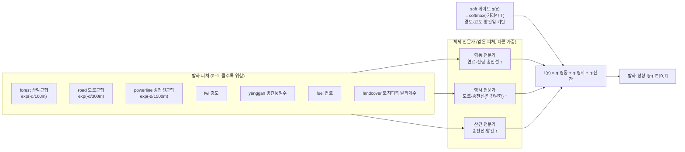
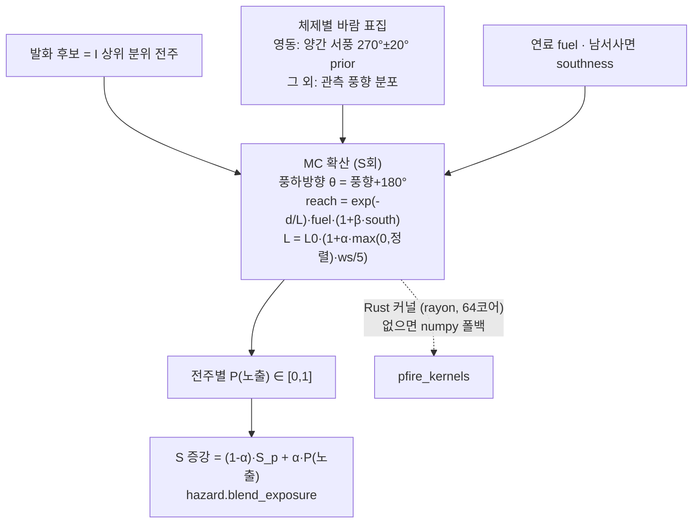
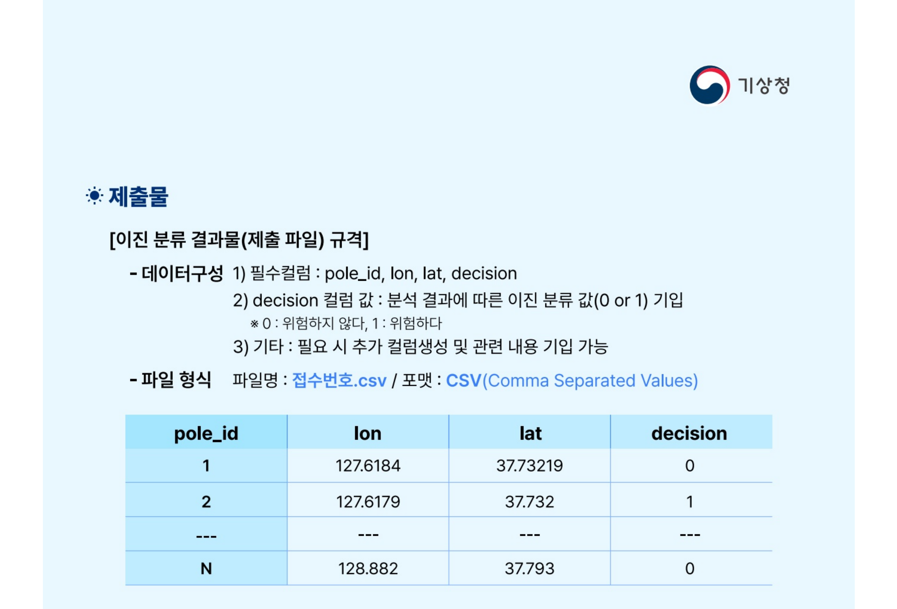

# MOSAIC — 전력설비(전주) 산불위험 조기경보 시스템

> **2026 날씨 빅데이터 콘테스트 · 주제1 재난안전** — 기상·공간정보 기반 전력설비 인근 화재 위험도 분석
> 주최 **기상청** · 참여기관 **한국전력공사(KEPCO)**

**MOSAIC** = **M**ixture-of-experts · **S**patial · **A**nchored(presence-only 발화점 앵커) · **I**gnition-physics(위험 = 발화 I × 확산 S × 기상 W) · **C**overage(per-regime conformal). 강원을 영동/영서/산간·시군·격자의 **모자이크(mosaic)** 로 보고 각 조각을 체제 전문가가 맡는 **지역 혼합전문가(Mixture-of-Experts)** 가 모델의 정체성입니다.

**한 줄 요약** — 강원도의 가상 전주 **138만 개** 하나하나에 대해 "매일 불이 시작될 성향 × 번질 취약성 × 그날의 기상"을 곱해 일별 위험을 계산하고, 산불조심기간(2~5월)을 모아 전주별 **위험/안전(0/1)** 을 판정합니다. 핵심은 **지역 혼합전문가(MoE) + 물리식 I×S×W + 베이지안 계층 사후·per-regime 커버리지**입니다. **정답 라벨이 없는 문제**라서, 과거 발화점은 학습이 아니라 **검증·임계값 결정의 앵커**로만 쓰고, 위험 자체는 **산불 물리식 + 지역별 전문가(MoE)** 로 비지도(unsupervised)에 가깝게 추정합니다.

---

## 🔑 우리 연구의 강점 (Why this is strong) — MOSAIC

설계의 모든 기둥이 **임시방편이 아니라, 여러 분야의 표준이 교차하는 지점**에 놓여 있습니다. 각 강점은 검증된 문헌으로 뒷받침됩니다 (전체 근거: [`claudedocs/research_strengths_literature_20260619.md`](claudedocs/research_strengths_literature_20260619.md)). MOSAIC 약자의 각 글자가 곧 강점의 축입니다.

| 강점 | 무엇이 강한가 | 근거 문헌 |
|---|---|---|
| **① presence-only를 정면 처리 (A)** | "기록 없음 ≠ 위험 없음". 거짓 음성을 만들지 않고, 발화점은 검증·임계 앵커로만 사용 | nnPU (Kiryo 2017) · 표본편향 (Phillips 2009) · 산사태 PU (2024) |
| **② 물리식 하이브리드 (I)** | 명시적 물리지식이 **순수 지수 대비 +40%, 순수 ML 대비 +9% F1**, 게다가 **해석가능** | Li 2024 (F1 0.846) · 분야 리뷰 (Singh 2024) |
| **③ 위험 = 발화 × 확산 × 기상 (I)** | 美 산불위험 평가 독트린(likelihood×intensity=hazard)과 동형 | Scott 2013 · USFS Wildfire Risk to Communities |
| **④ 지역 전문가 혼합(MoE) (M)** | 전역 단일/개별 모델의 **원리적 중간(partial pooling)** — MoE 30년 계보 + 공간 비정상성 | Jacobs 1991 · Shazeer 2017 · Gelman & Hill 2007 · Feng 2026 |
| **⑤ 공간 블록 CV + 격차 보고 (S)** | 무작위 CV는 성능을 **>50%→≈0까지 부풀림**. 우리 무작위-공간 격차 ≈ 0 = 그 함정 회피 증명 | Ploton 2020 · Roberts 2017 · Valavi 2019 |
| **⑥ 풍하 MC 노출 → v2.2 변별 dose (S)** | 美·加 운영 표준(FSim·Burn-P3) 패러다임. **v2.2**(발화가중 기대도즈+LWR타원+국지정규화)로 포화 해제 → **결정 결합 recall +0.0071 확정**(§3.4) | Ager 2012 · Anderson 1983 · Finney 2011 |
| **⑦ 양간지풍 방향 prior** | 일반 바람이 아닌 **강원 특이 푄(순간 20.4~27.6 m/s)** — 한국 시뮬로 검증된 결정적 기작 | KOSHAM 2021 · 기상관측 |
| **⑧ KEPCO 자산 우선순위화** | 가장 비교가능한 강원 ML(AUC 0.839)조차 **자산무관(asset-blind)** — 전주를 안 봄. 그 교집합이 우리 신규성 | Lee 2025 · Hennessy 2025 |
| **⑨ 베이지안 계층 사후 + per-regime 커버리지 (C)** | Poisson–Gamma 켤레 + BYM2 공간 CAR 로 zero-fire 지역을 부모로 축소(borrow strength), per-regime conformal 로 명목90% ≈ 실측0.90 **운영 커버리지 보장** | Gelman&Hill 2007 · Besag(BYM) · Angelopoulos&Bates 2021 |

---

## 목차

1. [문제 정의 — 무엇을 풀어야 하나](#1-문제-정의--무엇을-풀어야-하나)
2. [왜 이 프로젝트인가 — 기존 연구의 한계와 우리의 차별점](#2-왜-이-프로젝트인가--기존-연구의-한계와-우리의-차별점)
3. [모델 구조 및 아키텍처](#3-모델-구조-및-아키텍처)
4. [데이터 스펙](#4-데이터-스펙)
5. [설치 및 실행](#5-설치-및-실행)
6. [검증 결과](#6-검증-결과)
7. [제출물 스펙](#7-제출물-스펙)
8. [활용 방안](#8-활용-방안)
9. [로드맵](#9-로드맵)
10. [한계와 가정](#10-한계와-가정)
11. [프로젝트 구조](#11-프로젝트-구조)
12. [참고문헌](#12-참고문헌)

---

## 1. 문제 정의 — 무엇을 풀어야 하나

<p align="center">
  
  
</p>

### 대회가 요구하는 것

- **강원도 가상 전주 1,387,831개** 각각에 `decision` **0/1** (0=안전, 1=위험)을 매겨 **CSV로 제출**합니다.
- 정량 점수(20점)는 **KEPCO가 자체 생성한 비공개 정답**과의 **F1 score**.
- 정성 점수(80점) = 합리성(10) · 데이터 분석능력(20) · 활용성(20) · 창의성(20) · 부합성(10).

> 여기서 "전주(電柱)"는 도시 이름이 아니라 **전봇대(utility pole)** 를 뜻합니다. 대상 지역은 **강원도**입니다.

### 왜 지금, 왜 전주인가 — 현실 근거

- **2019 고성-속초 산불의 발화원은 KEPCO 전력설비였습니다.** 춘천지법 속초지원은 2023년 KEPCO에 피해자 64명 대상 **약 87억 원 배상**을 선고했고, 원인은 **전주의 개폐기·전선 아크 + 강풍**으로 인정됐습니다(산림 약 1,260ha 소실). 우리가 감시하는 자산이 **법적으로 입증된 발화원**입니다.
- **강풍은 양간지풍입니다.** 양양~간성 사이 서풍 푄("화풍")이 태백 협곡을 지나며 가속·건조되어, 2019년 당시 **순간최대 풍속 미시령 27.6 m/s·속초 20.4 m/s**를 기록했습니다. 일반 바람이 아니라 강원에 특이한 결정적 확산 기작입니다.
- **계절은 봄입니다.** 산림청 통계상 산불조심기간(2.1~5.15)에 **건수의 66%·피해면적의 99%**가 집중되고(3월만 31%), 원인은 대부분 사람(입산자 실화 15% + 논밭·쓰레기 소각 19%)입니다.

### 이 문제를 어렵게 만드는 두 가지

**① 정답(라벨)이 없습니다.**
KEPCO 정답은 채점할 때만 쓰이고 우리에게는 주어지지 않습니다. 즉, 일반적인 **지도학습을 쓸 수 없습니다.** 우리가 가진 산불 데이터(safemap 발화점 928건)는 *"불이 난 곳"* 만 기록돼 있고, *"불이 안 난 곳(진짜 음성)"* 은 없습니다. 어떤 전주에 불이 안 난 것이 **정말 안전해서인지, 아직 안 난 것인지** 구분할 수 없습니다. 이는 생태학의 종 분포 모델(**presence-only**), 보안의 침입탐지와 **수학적으로 같은 구조**이며 — 산사태·산불 위험지도 연구에서도 똑같이 다뤄집니다.

**② 점수의 80%가 정성평가입니다.**
따라서 점수만 잘 나오는 블랙박스가 아니라, **"왜 이 전주가 위험한지 설명되는, 현장에서 쓸 수 있는 시스템"** 이어야 합니다. 물리적으로 말이 되고(부합성), EDA와 일관되며(분석능력), 한전이 실제 순시 우선순위에 쓸 수 있어야(활용성) 합니다.

### EDA가 알려준 사실 (= 모델의 뼈대)

| 발견 | 모델에의 반영 |
|---|---|
| 발화의 **91%가 산림**, **봄(3~5월) 59%** 집중, 원인은 대부분 사람(입산자 실화·소각) | "산림에 가까운 전주"가 핵심 → `dist_to_forest` |
| 불의 **"크기"는 발화지형이 아니라 바람·ISI(초기확산)** 가 좌우 (풍속 ρ=+0.29, ISI +0.26) | 위험 = **발화확률 중심**, 번짐은 **바람 방향** |
| **2019 고성·속초 산불의 발화원 = 전력설비 아크** → 이 과제가 걱정하는 시나리오 | 설비 근접(`dist_to_powerline`)을 발화 성향에 반영 |
| 기상은 전주 단위가 아니라 **~13km 격자 단위**로 영향 (전주→최근접 관측소 중앙값 4.8km) | 전주 고유 변동은 발화항, 기상은 격자에서 공유 |

---

## 2. 왜 이 프로젝트인가 — 기존 연구의 한계와 우리의 차별점

정답이 없을 때 쓰는 정석 방법들을 **논문으로 재조사**한 결과, 각 방법은 우리 과제에서 다음과 같은 **명확한 한계**를 가집니다.

| 기존 접근 | 한계 (우리 과제 기준) | 근거 |
|---|---|---|
| **순수 지수(FWI·ERC·BI)** | 인간발화·설비발화·연료를 못 담음. 하이브리드 ML보다 F1 낮음 (지수 0.605~0.704 vs ML 0.776~0.846) | Li 2024 |
| **MaxEnt / presence-background** | 간단·해석은 쉽지만 **절대 위험확률을 못 줌**. 양성비율을 데이터만으로 알 수 없어 0.5로 가정 → 산출물은 **상대 순위(랭킹)** | Phillips 2006/2009 |
| **전 지역 단일 모델** | 영동/영서/산간은 발화·확산 메커니즘이 다른데, 평균에 묻혀 지역 특성이 사라짐 (공간 비정상성) | Brunsdon 1996 · Feng 2026 |
| **지역별 개별 모델** | 데이터가 쪼개져(고성 179, 화천 364건…) 과적합 | Gelman & Hill 2007 |
| **무작위 분할 검증** | 산불은 공간 자기상관이 강해, 무작위 CV는 성능을 크게 부풀림 (한 RF 지도는 무작위검증 >50% 설명 → 공간검증 거의 0) | Ploton 2020 · Roberts 2017 |
| **기존 강원 산불 ML** | 기상·지형·사회 변수만 봄 — **KEPCO 전주(설비) 자산은 모델하지 않음(asset-blind)** | Lee 2025 |

### 핵심 차별점 — "asset-blind"를 넘는다

가장 비교 가능한 선행연구인 **Lee et al. (2025, Scientific Reports) — 강원 일별 산불 예측 ML(최고 AUC 0.839)** 조차, 기상·산림·사회경제 변수만 쓰고 **전력설비(전주) 근접을 발화원으로 모델하지 않습니다.** 한편 전력자산의 산불 위험 우선순위화가 가치 있다는 것은 국제적으로 입증돼 있지만(Hennessy & Chester 2025: 캘리포니아 송전선 17%·변전소 19%가 고위험지), **강원 전주에 적용된 사례는 없습니다.**

그 **교집합 — (presence-only/PU) + (물리·양간지풍) + (KEPCO 자산 우선순위화)** 가 우리의 실질적 신규성입니다. 이를 위해 다음을 결합합니다.

1. **물리식을 본체로** — FWI·연료·발화원 근접 같은 산불 과학 지식을 명시적으로 넣습니다. 하이브리드는 순수 지수·순수 ML을 모두 능가하고 더 해석 가능합니다 (Li 2024; 분야 리뷰 Singh 2024). 인프라 근접이 인간발화의 최강 예측인자라는 점도 검증돼 있습니다 (Dorph 2022: 정확도 86~90%).
2. **지역별 전문가 혼합(MoE)** — 전역 단일과 개별 모델의 **중간(partial pooling)**. MoE의 30년 계보(Jacobs 1991 → Shazeer 2017)와 다수준 모델(Gelman & Hill 2007), 공간 비정상성(Brunsdon 1996 → Du 2020)의 합류입니다.
3. **발화점은 학습이 아니라 앵커로** — 귀한 발화점 928개를 **검증·임계값 결정의 기준**으로만 써서 누수를 막습니다 (nnPU Kiryo 2017; 배경표집 Phillips 2009; 자연재해 PU 우월성 산사태 2024).
4. **공간 블록 교차검증** — 무작위 분할의 낙관 편향을 차단하고, 무작위-공간 격차를 함께 보고합니다 (Ploton 2020, Roberts 2017, Valavi 2019).
5. **풍하 확산 MC 시뮬레이션** — 2019 고성 시나리오(양간지풍 서풍→동쪽 확산)를 확률 봉투로 재현해, "흉터 안/밖(0/1)"이 아니라 **노출 기대확률(연속)** 로 영향도를 봅니다. 이는 美·加의 앙상블 연소확률 운영표준과 동일 패러다임입니다 (Finney 2011, Burn-P3).

---

## 3. 모델 구조 및 아키텍처 (MOSAIC)

> MOSAIC 다섯 축이 그대로 §3의 골격입니다 — **M**oE 발화전문가(§3.3) · **S**patial 풍하확산·공간CV(§3.4) · **A**nchored presence-only 발화점(§3.2 빨강) · **I**gnition-physics I×S×W(§3.1) · **C**overage 베이지안 사후·conformal(§3.7).

### 3.1 핵심 아이디어 — 위험을 셋으로 분해

전주 `p`의 **하루치 위험**을 곱셈으로 분해합니다. 이 분해는 美 산불위험 평가의 표준 독트린(위험 = likelihood × intensity = hazard, 거기에 기상)과 동형입니다 (Scott 2013; USFS Wildfire Risk to Communities).

```
  h(p, t)  =   I(p)        ×    S(p)        ×    W(grid(p), t)
            발화 성향          확산·노출 취약        그날 기상 노출
            (전주 고정)        (전주 고정)         (격자·매일 변함)
```

**왜 곱셈인가?** 셋 중 하나라도 0이면 위험이 0입니다. 연료 없으면 안 나고, 아무리 마른 산림도 발화원 없으면 시작 안 하고, 비 오는 날은 안 납니다. 물리적으로 맞고, **각 항이 따로 해석돼서** "이 전주는 왜 위험?" → "산림 50m + 송전선 근접 + 4월 FWI 상위" 식으로 설명됩니다.

### 3.2 전체 파이프라인



> 🔴 빨강(발화점)은 **학습에 쓰지 않습니다.** 오직 검증과 임계값 결정에만 들어가 라벨 누수를 막습니다 (presence-only/PU 원칙).

### 3.3 발화 성향 I(p) — 지역별 전문가 혼합(MoE)

영동(해안)·영서(내륙)·산간은 발화 메커니즘이 다릅니다 — 산불 구동인자가 지역마다 다르다는 것은 실증돼 있습니다 (Feng 2026). **하드 시군 분할 대신**, 전주 피처(경도·고도·양간일)를 표준화해 체제 앵커와의 거리로 **softmax soft 게이트**를 만들고, 같은 피처를 체제마다 **다른 가중**으로 결합한 전문가들을 혼합합니다. 이는 MoE(Jacobs 1991; Shazeer 2017의 soft 게이트)와 다수준 모델의 **부분풀링(partial pooling, Gelman & Hill 2007)** 을 딥러닝으로 구현한 것입니다.



발화 피처는 7항(forest·road·powerline·fwi·yanggan·fuel·**landcover** 토지피복 발화계수)이며, **체제별 가중은 데이터로 튜닝합니다.** 초기값(EDA 눈대중)은 공간 CV 발화점 recall이 낮았기 때문에, 체제별 7항 가중을 **단순체(simplex)** 로 두고 **LHS(Dirichlet) 랜덤탐색 5,000후보 + 좌표상승**으로 **공간 블록 CV recall@top-k**(홀드아웃)를 최대화했습니다. 결과 provenance는 `outputs/tuned_weights.json`에 기록됩니다(매핑 발화점 706건). (→ [6. 검증 결과](#6-검증-결과))

### 3.4 확산·노출 취약 S(p) — 풍하 MC 시뮬레이션 (Rust 커널)

기본 `S`는 사전계산된 정적 취약도(`S_p`)지만, 선택적으로 **비등방(풍하) 몬테카를로 확산 프록시**로 증강합니다. 발화 후보(I 상위 분위)에서 시작해, 체제별 바람을 표집(영동은 양간지풍 서풍 prior)하여 N회 시뮬레이션하고, 전주별 **P(노출) = 불이 닿은 시뮬 비율**을 구합니다. 이 "확률 봉투" 방식은 美 FSim·加 Burn-P3 같은 **앙상블 연소확률 운영 표준과 동일 패러다임**이고(Finney 2011), 풍하로 길쭉해지는 신장항은 **바람구동 타원형 확산**의 고전 물리(Rothermel 1972)에 근거합니다.



성능 본체는 **Rust(PyO3/maturin)** 입니다. 균일격자 공간 인덱스로 반경 질의를 가속하고, rayon으로 시뮬 축을 병렬화합니다. **N=1.38M, M=2,000, S=256 기준 약 5.9초**(단일스레드 184.5초 대비 **약 31배**). Rust가 없으면 **동일 의미론의 numpy 폴백**으로 end-to-end가 돌아갑니다 (계약: `claudedocs/CONTRACT_rust_python.md`).

> **🆕 노출 v2.2 — 변별 가능 dose & 결정 반영 (`pfire/exposure_v2.py`)**
> 위 OR 확률(`P=1−∏(1−reach)`)은 영동에서 **P≈1 로 포화**(변별 IQR≈0.01)라 결정에 못 썼습니다. 이를 ① **발화가중 기대도즈**(OR→`Σ I_g·reach`, 누적이라 비포화; Ager 2012 source–sink), ② **Anderson LWR 타원**(좁고 긴 풍하 회랑; Anderson 1983·Richards 1990), ③ **격자 국지정규화**(영동 배경 제거→상대 노출; Getis–Ord)로 재설계해 **변별 그라데이션**을 만들었습니다.
> **검증**: 영동 변별 IQR **0.166→0.290**, 결정에 확률 OR 결합(`R ← 1−(1−R)(1−w·dose)`, w=0.5)했을 때 **공간블록 CV recall +0.0071**(5 fold-seed 일관 = 신호, 무작위-공간 격차≈0 = 낙관편향 없음, 2019 고성 방향 east_frac=1.0 유지). → "확산을 결정에 넣어야 한다"가 올바른 공식으로 입증돼 **이제 decision 에 반영**됩니다(`config.EXPOSURE_V2_BLEND_W`, 0 으로 끄기·0.25 보수). 설계·실측: [`exposure_v2/`](exposure_v2/README.md).

### 3.5 그날 기상 W → 시즌 위험 R(p) — 일별 ISI/FFMC 동역학 블렌드

기본 W는 더 이상 시즌 평균(fwi_q90) 단독이 아니라 **시즌 극값과 일별 fire-weather 동역학의 블렌드**입니다 (`weather.blended_weather`, 가중 `config.W_BLEND_SEASON_WEIGHT`).

- **W (기본·블렌드)**: 전주 고유 **시즌 극값**(season_weather: fwi_q90·양간 — 2019 고성 극값 포착)과 **일별 ISI/FFMC 동역학**(daily_isi_weather: ISI=초기확산 준비·FFMC=발화 준비, top-10% recall 이득)을 [0,1] 선형 블렌드. 일별만 쓰면 전주 고유 극값이 희석돼 고성 sanity가 퇴행(0.698→0.230)하므로, 시즌 극값을 함께 보존해 고성 순위를 회복하면서 recall을 유지·개선합니다.
- **W (시즌 MVP)**: `--legacy-season-weather` — 전주 사전계산 시즌통계(FWI 강도 + 고위험일 빈도 + 양간풍).
- **W (일별 관측 엔진)**: `--daily-weather` — 각 전주를 최근접 관측소에 매핑해, 산불조심기간(2~5월) 일별 FWI가 임계(10.0)를 넘은 날 수를 연평균 → 조기경보 폴백 프레이밍.
- **시즌 집계**: 단일 W면 `R = I×S×W`. 여러 날이면 일별 `h`의 **기하평균(로그합)** 으로 집계해 단발 고위험일의 과대평가를 완화.

### 3.6 임계값 결정 — F1을 실제로 좌우하는 곳 (per-regime 컷)

모델은 **순위**를 주고, **0/1 컷은 별도 결정**입니다 (presence-only는 절대 양성비율을 데이터만으로 못 줌, Phillips 2006). 정답 양성비율 π를 모르므로:

- **F1 민감도 곡선**: π를 0.5%~10%로 바꿔가며 가상 F1·임계값을 함께 보고 → "정답 비율을 몰라도 이 구간에선 안정적"임을 보임.
- **단조 보정(isotonic/PAVA)**: 위험점수 → 사이비 확률로 단조화 (sklearn 미사용, 직접 구현). 해석·보고용.
- **per-regime(체제별) 임계값**: 전역 단일 컷은 양성의 **95%가 영동에 쏠립니다**(W가 영동에서 2.42× 높은 곱셈 효과, → §6 EDA). 그래서 컷을 체제마다 따로 잡아 **각 체제에서 2% 균등** 양성을 뽑습니다(`adopt_alloc_mode="regime_count"`) → 영동 6,112 · 영서 13,246 · 산간 8,399 (합 27,757), 영서·산간 발화(인간발화·연료)도 놓치지 않습니다.
- **운영 양성비율로 컷 결정**: 기본 2% (한전 점검 capacity 기반 등으로 조정 가능).

### 3.7 베이지안 계층 사후 + per-regime 커버리지 (MOSAIC의 C)

순위·0/1을 넘어 **"얼마나 확신하는가"**를 정량화합니다. 이는 recall을 끌어올리는 레버가 아니라 **정성·운영·통계적 rigor 가치**입니다.

- **계층 partial pooling (경험적 베이즈)** — `pfire/hierarchy.py`: 전역→체제(3)→시군(16)→격자(106) 4단 계층에서 Poisson–Gamma 켤레의 닫힌형 사후평균 `λ̃ = (y+α)/(n+β)`로, 발화 0~소수인 소표본 시군(화천·인제·고성·태백)을 부모율로 **축소(borrow strength)**해 과적합을 막습니다. 출력은 전역평균≈1 중심의 **상대 배율**(곱셈 파이프라인 R에 자연스러운 단위).
- **베이지안 계층 사후분포** — `pfire/posterior.py`: 위 점추정을 **full posterior**로 승급. 지역 발화율 사후 Gamma(α, β)를 MC로 draw(기본 200)해 물리 base_risk(I·S·W·exposure)에 곱하고, 전주별 위험의 **credible 밴드(`risk_lo`/`risk_hi`)**를 산출합니다. 공간 평활은 **Poisson–Gamma**(기본) 또는 **BYM2 공간 CAR**(`--posterior-spatial bym`, 구조화 공간효과+비구조화 이질성) 백엔드를 선택할 수 있습니다.
- **per-regime conformal 커버리지** — 발화점 앵커로 split-conformal 분위(`--conformal-alpha 0.10`)를 체제별로 잡아, 명목 90% 대비 **실측 커버리지**를 체제마다 보고·보정합니다(→ §6 표). credible 밴드 단독은 과커버(1.0)하므로 conformal로 명목치에 맞춥니다.
- **누수 방지**: hierarchy·posterior 모두 `fires`를 인자로 받아 **공간 CV의 train fold 발화점만**으로 율을 추정합니다 — test fold 정보가 배율·사후에 새지 않고, 어떤 전주도 자신이 양성이라는 라벨을 받지 않습니다(지역 집계 앵커로만 사용).

---

## 4. 데이터 스펙

전체 데이터 명세는 [`used_dataset/README.md`](used_dataset/README.md)에 정리돼 있습니다 (스냅샷 2026-06-18, **23개 파일 / 423MB**). 산불 데이터는 **safemap 전용**(FIRMS 미사용)이며, 결과물·예보(fwi_grid)는 제외합니다. `used_dataset/`은 **READ-ONLY**이며 `.gitignore`로 저장소에서 제외됩니다.

핵심 입력만 추리면:

| 구분 | 파일 | 행수 | 용도 |
|---|---|---|---|
| 전주 | `pole_features.parquet` | 1,387,831 | 지형·연료·`dist_to_forest`·FWI 통계 (기준 테이블) |
| 전주 | `pole_power.parquet` | 1,387,831 | `dist_to_powerline` / `dist_to_substation` (설비발화) |
| 전주 | `pole_static_overlay.parquet` | 1,387,831 | `mu_*`, `S_p` (확산취약 사전계산) |
| 전주 | `pole_sgg.parquet` / `pole_fwi_obs.parquet` | 1,387,831 | 시군 매핑 / 관측기반 전주 FWI |
| 발화 | `safemap_positives.parquet` | 928 | **발화점 — 검증·임계값 앵커 전용** |
| 기상 | `fwi_station_daily.parquet` / `aws_obs_daily.parquet` | 377,822 | 관측소 일별 FWI·풍속 / 풍향 (MC 풍향 표집) |
| 기상 | `aws_stations_coords_elev.csv` | 109 | 관측소 좌표 (최근접 매핑) |

- **좌표계**: 입력 EPSG:4326(위경도). 거리/확산 계산은 강원 대표 위도(37.7°) 기준 cos 보정 **평면 근사 km**로 변환 (`pfire/geo.py` 단일 구현).
- **데이터 무결성**: 모든 전주 parquet은 `pole_id` 0..1,387,830으로 정렬·정합되어 있으며, 로더(`pfire/io.py`)와 제출 검증(`pfire/submit.py`)이 행수·정렬·유일성을 **강제 검증**합니다. 소수 결측(ndvi/s2 각 3개 등)은 전역 중앙값으로 채우고 그 개수를 로깅합니다.

---

## 5. 설치 및 실행

### 환경 설정 ([uv](https://github.com/astral-sh/uv))

```bash
# Python 3.12+, 의존성 동기화
uv sync

# (선택) Rust 풍하 확산 커널 빌드 — 없어도 numpy 폴백으로 동작
uv pip install maturin
cd rust/pfire_kernels
PATH="$HOME/.cargo/bin:$PATH" ../../.venv/bin/maturin develop --release
```

### End-to-end 실행

```bash
# 로드 → I(MoE) → S → W(블렌드) → R → per-regime 임계값 → 공간CV/sanity
#   → 베이지안 사후·conformal 커버리지 → submission.csv
.venv/bin/python scripts/run_phase1_mvp.py --prevalence 0.02

# 변형 양성비율 제출들 동시 생성 (submission_p0.005 … p0.1, pctile)
.venv/bin/python scripts/run_phase1_mvp.py --submission-variants

# 일별 관측 엔진(W = 관측소 일별 FWI 고위험일) 폴백
.venv/bin/python scripts/run_phase1_mvp.py --daily-weather

# 풍하 노출 실연동(Rust 커널) + 방향 sanity
.venv/bin/python scripts/run_phase1_mvp.py --exposure --exposure-alpha 0.0

# 베이지안 사후 백엔드/커버리지 옵션
#   --posterior on|off · --posterior-spatial poisson_gamma|bym · --posterior-draws 200
#   --conformal-alpha 0.10 · --decision-from alloc|conformal
.venv/bin/python scripts/run_phase1_mvp.py --posterior-spatial bym
```

출력: `outputs/submissions/submission.csv` (+ 진단 `outputs/regime_threshold_analysis.json`).

### 체제 가중 튜닝

```bash
# 공간블록 CV recall 목적함수로 EXPERT_WEIGHTS 재튜닝 → outputs/tuned_weights.json
.venv/bin/python scripts/tune_weights.py --n-random 5000 --workers 60
```

### 그림·EDA

```bash
.venv/bin/python scripts/make_figures.py   # outputs/figures/ (10장)
.venv/bin/python scripts/eda_derived.py    # outputs/figures/eda/ (11장) + claudedocs EDA
```

### 테스트

```bash
.venv/bin/python -m pytest tests/ -q   # 데이터 없이도 도는 합성입력 단위테스트 116개
```

---

## 6. 검증 결과

정답 라벨이 없어도 **과거 발화점**으로 간접 검증하되, **공간 자기상관 누수**를 막는 것이 핵심입니다. 이 방법론적 엄격성 자체가 강점입니다 — 무작위 CV는 공간 데이터에서 성능을 크게 부풀리는 것으로 잘 알려져 있습니다(Ploton 2020: 무작위검증 >50% 설명 → 공간검증 거의 0; Roberts 2017).

### 공간 블록 교차검증 (10km 블록 GroupKFold)

발화점 **recall@top-k** (홀드아웃, 강원 전체; per-regime alloc 컷 기준 최종 decision):

| 지표 | 튜닝 전 (EDA 눈대중) | 튜닝 후 |
|---|---|---|
| recall@top-1% | 0.019 | **0.019** |
| recall@top-2% | 0.040 | **0.043** |
| recall@top-5% | 0.099 | **0.101** |
| recall@top-10% | 0.168 | **0.176** |

- **튜닝 방법**: LHS(Dirichlet) 랜덤탐색 5,000후보 + 좌표상승, simplex를 0.05 격자로 양자화(미세과적합 회피), 목적=공간CV recall@top-{1,2,5,10}% 가중평균. 매핑 발화점 706건(고유 전주 685개).
- **랜덤 기준선 대비**: 무작위 선택의 기대 recall은 곧 top-k 비율(예: top5%≈0.05)이므로, **튜닝 후 top5%≈0.101은 랜덤의 약 2배**입니다. 천장(2배 수준)은 **앵커·피처 한계**이지 모델 실패가 아닙니다(→ 아래 파생변수 EDA).
- **낙관 편향 감시**: 무작위분할 vs 공간분할 recall **격차 ≈ 0** (top-5%에서 spatial 0.101 vs random 0.089, gap ≈ -0.012, 즉 부풀림 없음). → Ploton 함정에 빠지지 않았다는 직접 증거.
- **지표 선택의 근거**: 참음성을 모르는 희귀·광역 문제라, ROC-AUC 대신 **recall@top-k / PR 계열**을 사용합니다 (Sofaer 2019, Li & Guo 2021).

### per-regime 커버리지 — 베이지안 사후 + conformal

명목 90% 밴드의 **실측 커버리지**(공간 CV, 체제별; `outputs/regime_threshold_analysis.json`):

| 구간 | 명목 | conformal 실측 | credible 실측 | n_test |
|---|---|---|---|---|
| 전체 | 0.90 | **0.902** | 1.000 (과커버) | 685 |
| 영동 | 0.90 | **0.907** | 1.000 | 151 |
| 영서 | 0.90 | **0.902** | 1.000 | 389 |
| 산간 | 0.90 | **0.897** | 1.000 | 145 |

- **해석**: credible 밴드 단독은 모든 체제에서 1.0으로 **과커버**(보수적)하지만, **per-regime conformal로 명목 90%에 정확히 보정**됩니다(전체 0.902, 체제별 0.897~0.907 합격). 이는 recall 레버가 아니라 **운영·rigor 가치** — "이 위험은 얼마나 신뢰할 수 있나"를 체제별로 보장합니다.

### Sanity 체크 — 2019 고성 산불

- **위치**: 고성 발화점(128.50°E, 38.21°N) 반경 전주(3,465개)의 **평균 위험백분위 = 0.602** — 인근 전주가 고위험 쪽에 위치함을 확인.
- **방향성**: 풍하 노출이 실제 burn-scar 방향(서→동, ~6.7km)으로 신장되는지(`east_frac > 0.5`) 확인. (양간지풍 수치시뮬이 실제 고성 확산과 일치한다는 KOSHAM 2021과 정합.)

### asset-aware ablation + 설비원인 화재 검증 (novelty 정직 검증)

우리 핵심 novelty("전주=전력설비 자산을 발화원으로 모델")의 실효를 두 실험으로 정직하게 검증했습니다(`pfire/ablation.py`·`fire_cause.py`, 산출 `outputs/ablation_*.json`·`equipment_cause_validation.json`).

**실험 A — asset-aware vs asset-blind 공정 LOGO ablation** (S·W·게이트·앵커·블록 **고정**, feature_set + 재튜닝 가중만 변경 → asset의 순효과 분리):

| arm | top5% | top10% |
|---|---|---|
| blind (powerline 제외) | 0.092 | **0.189** |
| aware (+powerline) | **0.103** | 0.183 |
| plus (+substation) | 0.098 | 0.177 |

→ 설비 근접 피처는 **거의 중립**(top5% +0.011 / top10% −0.006). 즉 powerline *피처 자체*는 발화점 recall을 뚜렷이 못 올림(공유 물리에 흡수).

**실험 B — 원인별 recall** (safemap `resn` 238종을 설비/작업/인간/자연/미상 5범주 분류, 모델 비의존):

| 원인 | n(매핑) | recall@5% | recall@10% |
|---|---|---|---|
| **설비전기 grid_electric** | 18 | **0.111** | **0.167** |
| 인간 human | 476 | 0.079 | 0.151 |
| 작업스파크 / 자연 | 17 / 16 | 0.000 | 0.000 |

→ **설비원인 화재가 인간발화보다 더 잘 회수됨**(top10% 0.167 vs 0.151) — 위험맵이 KEPCO 관심사인 설비화재에 (인간발화 이상으로) 정렬한다는 *방향적* 증거.

**정직한 결론**: 설비 n=18로 매우 희소 → **통계적 유의가 아니라 방향·메커니즘만**(train/test 미분리 pooled). 종합: 고위험 전주가 설비화재를 인간발화 이상으로 포착하나(B), 그게 powerline *피처* 때문은 아님(A, ~중립). **"asset novelty"는 *프레이밍·정렬* 로는 지지되되 *단일 피처 기여* 로는 미약** — 다년·다건 설비화재 라벨 도착 시 재검증 대상.

### 파생변수 심화 EDA — 정직한 발견 (천장의 출처)

모델이 실제 쓰는 파생변수를 발화점 앵커로 EDA했습니다 (`scripts/eda_derived.py` · [`notebooks/EDA_derived.ipynb`](notebooks/EDA_derived.ipynb) · 정리 [`claudedocs/eda_파생변수_심화_20260619.md`](claudedocs/eda_파생변수_심화_20260619.md) · 그림 `outputs/figures/eda/` 11장). 핵심은 자랑이 아니라 **한계의 정직한 출처 규명**입니다.

| # | 발견 | 함의 |
|---|---|---|
| ① | **단일 파생변수의 분리력이 약함** — 모든 단일변수 AUC-PR이 기저율 대비 lift **~1.5~1.9×**에 그침(최강 S_p·mu_flammability조차) | recall 천장은 **피처 한계이지 모델 실패가 아님**. 위험은 단일변수가 아니라 I·S·W 결합 + 임계값에서 나옴 |
| ② | **영동 쏠림의 기계적 원인 = W** — 영동/비영동 평균 배율이 I 1.24×·S 0.95× 인데 **W는 2.42×**. 곱셈 R에서 W가 영동을 끌어올려 상위2% 위험의 **95%가 영동** | per-regime 임계값(§3.6)으로 비영동 recall을 보강하는 근거 |
| ③ | **다중공선성 강함** — FWI 3종 VIF 38~69(fwi_mean 68.7·fwi_q90 38.4), 최강 중복쌍 fwi_q90↔fwi_mean r=0.98 | 입력 축소 후보(정리 대상) |
| ④ | **`unc_lo`가 상수 0 (죽은 컬럼)** | 알려진 정리 대상 — 유효 밴드는 `risk_lo`/`risk_hi`(→ §10) |
| ⑤ | **공간 자기상관 강함** — Moran's I: risk_score 0.633 · R 0.596 · dist_to_forest 0.984 | 무작위 CV 낙관편향 확인 → **공간 블록 CV가 정당** |

---

## 7. 제출물 스펙

<p align="center">
  
</p>

제출 CSV는 **필수 4칸 + 해석·운영용 추가 컬럼 = 총 14컬럼**입니다. 무결성(행수 1,387,831 · `decision` 0/1만 · `pole_id` 정렬·유일)을 `pfire/submit.py`가 강제 검증합니다. 컬럼 순서:

| 컬럼 | 구분 | 설명 |
|---|---|---|
| `pole_id`, `lon`, `lat`, `decision` | **필수** | 전주 식별/좌표 + 0/1 결정 |
| `risk_score` | 위험 | 단조 보정 위험 점수 |
| `regime` | 해석 | 우세 체제(영동/영서/산간) — 왜 위험한지 |
| `p_exposure` | 해석 | 풍하 노출확률 |
| `risk_lo`, `risk_hi` | 사후 | 베이지안 사후 credible 밴드(유효 불확실성) |
| `ops_priority` | 운영 | "고위험 × 고불확실" 현장 확인 1순위 플래그(111,462개) |
| `unc_lo`, `unc_hi` | 사후 | 불확실성 밴드(`unc_lo`는 현재 상수 0 — 정리 대상, §10) |
| `risk_pctile` | 표시 | 전체 위험 백분위(0~100, 순위·decision 불변) |
| `risk_pctile_regime` | 표시 | 체제 내 위험 백분위 |

- 추가 컬럼으로 **"왜·얼마나 확신하는지"** 까지 전달해 정성평가(활용성·창의성)에 대응합니다.
- **변형 제출물**: 양성비율별 `submission_p0.005.csv … submission_p0.1.csv`와 백분위 기반 `submission_pctile.csv`도 함께 생성됩니다(`--submission-variants`).

---

## 8. 활용 방안

한전 실무의 **"우선순위 선정 모델"** 에 정확히 부합합니다. 전력자산의 산불 위험 우선순위화가 가치 있고 위험이 소수 자산에 집중된다는 점은 국제적으로 입증돼 있습니다 (Hennessy & Chester 2025).

- **일별 조기경보** — 고위험일 풍하 고위험 전주 → 당일 순시·예찰 우선순위 자동 생성.
- **시즌 보강 계획** — 시즌 `R(p)` 상위 전주 → 절연 보강·수목 제거(line clearance) 대상 선정.
- **불확실성 활용** — "위험하지만 불확실"한 전주는 현장 확인 1순위(능동 라벨 수집) → 다음 시즌 모델이 더 똑똑해지는 선순환.
- **실사례 근거** — 같은 패러다임(하루 1억+ 시뮬)으로 운영되는 PG&E의 2022년 배전선 보고대상 발화는 전년 대비 **68% 감소**했습니다(Technosylva/PG&E WMP). 단, 이는 시뮬 단독 효과가 아니라 지중화·설비설정·수목관리를 포함한 **프로그램 전체 성과**입니다. 본 시스템은 그 패러다임의 강원·전주 경량판입니다.

---

## 9. 로드맵

현재(Phase 1~5b)는 **물리식 + MoE + 튜닝 가중 + MC 노출 + 일별 W 블렌드 + 계층 partial pooling + 베이지안 사후 + per-regime conformal**까지 갖춘 MOSAIC 전체가 동작합니다. 각 단계는 문헌으로 뒷받침됩니다.

| 단계 | 내용 | 근거 | 상태 |
|---|---|---|---|
| 1. 물리 사전점수 + W | FWI×연료×발화원 → baseline 위험맵 | Li 2024 · Scott 2013 | ✅ |
| 2. 발화 성향 I(p) + 가중 튜닝 | MoE + 공간CV recall 최적화 | Jacobs 1991 · Gelman&Hill 2007 | ✅ |
| 3. 풍하 확산 S(p) | MC 노출 시뮬(Rust), dNBR 방향 sanity | Finney 2011 · Rothermel 1972 | ✅ |
| **4. 일별 ISI/FFMC 동역학 W** | 시즌 극값(fwi_q90) + 일별 fire-weather(ISI 확산·FFMC 발화준비) 동역학 블렌드 → 시즌 집계 | CFFDRS · 일별>시즌 skill | ✅ |
| **5. 계층 partial pooling + 베이지안 사후** | 체제→시군→격자 EB 축소(zero-fire는 부모로 borrow) + Poisson–Gamma/BYM2 full posterior credible 밴드 | Gelman&Hill 2007 · Besag(BYM) | ✅ |
| **5b. per-regime conformal 커버리지** | noisy 앵커로 체제별 split-conformal → 명목90% ≈ 실측0.90 보정(credible 과커버 1.0 교정) | Angelopoulos&Bates 2021 · CP label-noise 2024 | ✅ |
| 6. ISI-조건부 풍하확산 | 고-ISI/강풍 맥락에만 노출 반영(전역 희석 회피) | Finney 2011 · Rothermel 1972 | 🔜 |
| ⏸ FiLM 딥 계층 / nnPU 딥 PU | **보류** — 양성 ~700·소표본이라 딥은 과적합 위험. 데이터 늘면 옵션 | Perez 2018 · Turkoglu 2022 · Kiryo 2017 | 보류 |

> **방향 전환 근거**: 정답 없음 + 양성 ~700 + 지역그룹 구조에선 딥(FiLM/nnPU)보다 **통계적 계층(partial pooling/EB) + 일별 fire-weather 동역학**이 더 방어 가능하고 과적합이 적다(문헌 검토 결과). 상세: [`claudedocs/research_방향검토_계층vsFiLM_20260619.md`](claudedocs/research_방향검토_계층vsFiLM_20260619.md). 설계 근거 전체는 [`claudedocs/기획서_전주산불위험_조기경보_20260618.md`](claudedocs/기획서_전주산불위험_조기경보_20260618.md)·[`claudedocs/research_strengths_literature_20260619.md`](claudedocs/research_strengths_literature_20260619.md).

---

## 10. 한계와 가정

- **절대 확률이 아님** — presence-only 특성상 산출물은 **상대 순위**입니다(Phillips 2006). 0/1 컷은 양성비율 가정에 의존하며, F1 민감도 곡선으로 그 의존성을 투명하게 보고합니다.
- **recall 천장은 피처 한계** — 공간 CV recall@top5%≈0.10(랜덤의 ~2배)이 천장입니다. 파생변수 EDA(§6)에서 **모든 단일변수 AUC-PR이 기저율 대비 lift ~1.5~1.9×**로 약함을 확인했습니다 — 이는 presence-only + 발화 희소 + 거리/연료의 약한 단조신호에서 오는 **피처·앵커 한계이지 모델 실패가 아닙니다.**
- **F1/커버리지는 직접 다른 메커니즘** — F1의 0/1은 **체제별 alloc 컷**이 결정하고, conformal 커버리지는 **운영 옵션**입니다. 베이지안 사후·BYM2·conformal은 recall을 끌어올리는 레버가 아니라 **정성·운영·통계적 rigor 가치**(zero-fire 지역 안정화, 체제별 신뢰구간 보장)임을 정직히 밝힙니다. credible 밴드는 단독으로 과커버(1.0)하며 conformal로 명목치(0.90)에 보정됩니다.
- **`unc_lo`는 죽은 컬럼(정리 대상)** — 제출물의 `unc_lo`는 현재 상수 0이라 정보가 없습니다(EDA §7 확인). 유효 불확실성 밴드는 `risk_lo`/`risk_hi`이며, `unc_lo`는 향후 제거 또는 실제 하한 추정으로 대체할 알려진 정리 대상입니다.
- **발화 후보 가정** — MC 노출의 발화원은 발화점 라벨이 아니라 "I 상위 분위 = 위험 환경에서 불이 시작된다"는 가정으로 둡니다.
- **풍하 노출 — 방향은 검증·적용, 크기만 보류** — 확산 *방향*(풍하·남서사면)은 2019 고성 dNBR로 **우리 데이터에서 검증**됨(공식면적 83% 일치 · burn 안/밖 남서사면도 −0.59→−0.22, **p=5e−13**)이고 2022 울진·삼척(참조)·양간지풍 메커니즘(KOSHAM 2021)과 일치 → **검증된 방향 prior를 MC 커널로 전 전주에 적용**합니다(정석). 다만 전주별 노출 *크기*(절대 P값)는 다건 보정이 안 돼, 그 **크기를 F1 결정에 블렌드하는 것만** 기본 off(`--exposure-alpha 0`)입니다. 즉 **방향은 적용하되, 크기는 운영·sanity·영동 조기경보 용도**로 둡니다.
- **평면 근사** — 거리/확산은 강원 위도 기준 cos 보정 평면 km. 광역 강원에서 충분하지만 위경도 정밀 측지는 아님.

---

## 11. 프로젝트 구조

```
OR-project/
├── pfire/                      # 위험 추정 파이프라인 (단일 진실: config.py)
│   ├── config.py               # 경로·상수·체제·시즌·시드·튜닝가중·W블렌드·사후설정
│   ├── io.py                   # polars 마스터 프레임 조인 + 무결성 검증
│   ├── geo.py                  # lon/lat ↔ 평면 km 단일 변환
│   ├── regimes.py              # 체제 soft 게이트 (MoE)
│   ├── experts.py              # 체제별 물리식 전문가(7항 피처) → I(p)
│   ├── weather.py              # 기상 W — 시즌 극값 + 일별 ISI/FFMC 동역학 블렌드
│   ├── exposure.py             # 풍하 노출 (Rust 래퍼 + numpy 폴백)
│   ├── exposure_engine.py      # 발화후보·바람표집·체제결합
│   ├── hazard.py               # h = I×S×W, 시즌 집계 R(p)
│   ├── hierarchy.py            # 계층 partial pooling(경험적베이즈) 지역 배율
│   ├── posterior.py            # 베이지안 사후(Poisson–Gamma 켤레 + BYM2 공간 CAR)
│   ├── risk_index.py           # 위험 백분위 표시(순위·decision 불변 재척도)
│   ├── calibrate.py            # 발화점 앵커·단조보정·F1 민감도·임계값·per-regime alloc
│   ├── validate.py             # 공간 블록 CV·sanity·낙관편향·커버리지 진단
│   └── submit.py               # 제출 CSV(14컬럼) 구성 + 스키마 강제 검증
├── rust/pfire_kernels/         # MC 풍하 확산 커널 (PyO3/maturin, rayon)
│   └── src/{lib.rs, grid.rs}   # 시뮬 코어 + 균일격자 공간 인덱스
├── scripts/
│   ├── run_phase1_mvp.py       # end-to-end 실행 (W블렌드·사후·conformal 포함)
│   ├── tune_weights.py         # 체제 가중 공간CV 튜닝
│   ├── run_phase3.py           # 토지피복·조건부 노출 실험
│   ├── phase4_hierarchy_demo.py# 계층 partial pooling 데모
│   ├── make_figures.py         # 결과 그림 10장 (outputs/figures/)
│   └── eda_derived.py          # 파생변수 심화 EDA 11장 + 정리 문서
├── tests/{test_units.py, test_hierarchy.py}  # 합성입력 단위테스트 116개
├── claudedocs/                 # 기획서 + 인터페이스 계약 + 문헌·EDA 조사
├── ebook_pages/                # 대회 설명자료(이미지)
├── notebooks/{EDA.ipynb, EDA_derived.ipynb}  # 탐색적 + 파생변수 EDA
├── outputs/                    # submission.csv · 진단 JSON · figures
└── used_dataset/               # 입력 데이터 (READ-ONLY, gitignore)
```

---

## 12. 참고문헌

> 모든 출처는 실재·검증됨(URL/DOI 확인). 일부는 출판사 WAF로 본문 직접 접근이 막혀 Crossref/arXiv 메타데이터로 교차검증했으며, 검증 메모·flag는 [`claudedocs/research_strengths_literature_20260619.md`](claudedocs/research_strengths_literature_20260619.md)에 있습니다.

**Presence-only / PU 학습**
- Kiryo, Niu, du Plessis, Sugiyama (2017). Positive-Unlabeled Learning with Non-Negative Risk Estimator. *NeurIPS 2017.* [arXiv:1703.00593](https://arxiv.org/abs/1703.00593)
- Phillips, Anderson, Schapire (2006). Maximum entropy modeling of species geographic distributions. *Ecological Modelling* 190:231–259. [DOI](https://doi.org/10.1016/j.ecolmodel.2005.03.026)
- Phillips et al. (2009). Sample selection bias and presence-only distribution models. *Ecological Applications* 19(1):181–197. [DOI 10.1890/07-2153.1](https://doi.org/10.1890/07-2153.1)
- (2024) Enhancing landslide susceptibility mapping using a positive-unlabeled ML approach. *Geoenvironmental Disasters.* [DOI 10.1186/s40677-024-00281-w](https://doi.org/10.1186/s40677-024-00281-w)

**물리-하이브리드 & 위험 분해**
- Li et al. (2024). Projecting Large Fires in the Western US With an Interpretable and Accurate Hybrid ML Method. *Earth's Future* 12(10). [DOI 10.1029/2024EF004588](https://doi.org/10.1029/2024EF004588) — F1 0.846, 지수 대비 +40%·ML 대비 +9%.
- Singh et al. (2024). Physics-based and ML-based wildfire spread models: a review. *J. Forestry Research* 35:135. [DOI 10.1007/s11676-024-01783-x](https://doi.org/10.1007/s11676-024-01783-x)
- Scott, Thompson, Calkin (2013). A wildfire risk assessment framework. *USDA RMRS-GTR-315.* [link](https://research.fs.usda.gov/treesearch/56265) · USFS [Wildfire Risk to Communities](https://wildfirerisk.org/understand-risk/)
- Dorph et al. (2022). Modelling ignition probability for human- and lightning-caused wildfires. *NHESS* 22:3487–3499. [DOI 10.5194/nhess-22-3487-2022](https://doi.org/10.5194/nhess-22-3487-2022)

**MoE / 부분풀링 / 공간 비정상성**
- Jacobs, Jordan, Nowlan, Hinton (1991). Adaptive Mixtures of Local Experts. *Neural Computation* 3(1):79–87. [DOI](https://doi.org/10.1162/neco.1991.3.1.79)
- Shazeer et al. (2017). Outrageously Large Neural Networks: The Sparsely-Gated MoE Layer. *ICLR 2017.* [arXiv:1701.06538](https://arxiv.org/abs/1701.06538)
- Gelman & Hill (2007). Data Analysis Using Regression and Multilevel/Hierarchical Models. *Cambridge UP.* [DOI](https://doi.org/10.1017/CBO9780511790942)
- Besag, York, Mollié (1991). Bayesian image restoration ... (BYM 공간 CAR). *Ann. Inst. Statist. Math.* 43(1):1–20. [DOI 10.1007/BF00116466](https://doi.org/10.1007/BF00116466) · Riebler et al. (2016). An intuitive Bayesian spatial model (BYM2). *Stat. Methods Med. Res.* 25(4). [DOI 10.1177/0962280216660421](https://doi.org/10.1177/0962280216660421)
- Brunsdon, Fotheringham, Charlton (1996). Geographically Weighted Regression. *Geographical Analysis* 28(4). [DOI](https://doi.org/10.1111/j.1538-4632.1996.tb00936.x) · Du et al. (2020) GNNWR. *IJGIS* 34(7). [DOI](https://doi.org/10.1080/13658816.2019.1707834)
- Feng et al. (2026). Spatial Heterogeneity ... of Wildfire Drivers Across ... China. *Remote Sensing* 18(7):1007. [DOI 10.3390/rs18071007](https://doi.org/10.3390/rs18071007)

**공간 교차검증 & presence-only 지표**
- Ploton et al. (2020). Spatial validation reveals poor predictive performance of large-scale ecological mapping models. *Nature Communications* 11:4540. [DOI 10.1038/s41467-020-18321-y](https://doi.org/10.1038/s41467-020-18321-y)
- Roberts et al. (2017). Cross-validation strategies for data with ... spatial ... structure. *Ecography* 40(8):913–929. [DOI 10.1111/ecog.02881](https://doi.org/10.1111/ecog.02881)
- Valavi et al. (2019). blockCV. *Methods Ecol. Evol.* 10(2):225–232. [DOI 10.1111/2041-210X.13107](https://doi.org/10.1111/2041-210X.13107)
- Sofaer, Hoeting, Jarnevich (2019). AUC-PR for rare binary events. *MEE* 10(4):565–577. [DOI 10.1111/2041-210X.13140](https://doi.org/10.1111/2041-210X.13140) · Li & Guo (2021). ROC/PR from presence-background data. *Ecol. Evol.* 11(15). [DOI 10.1002/ece3.7826](https://doi.org/10.1002/ece3.7826)

**몬테카를로 비등방 풍하 확산**
- Finney et al. (2011). A Method for Ensemble Wildland Fire Simulation. *Environ. Model. Assess.* 16(2):153–167. [DOI 10.1007/s10666-010-9241-3](https://doi.org/10.1007/s10666-010-9241-3) · USFS [FSim](https://research.fs.usda.gov/firelab/projects/fsim) · [Burn-P3](https://www.canadawildfire.org/burn-p3-english)
- Rothermel (1972). A Mathematical Model for Predicting Fire Spread in Wildland Fuels. *USFS INT-115.* [link](https://research.fs.usda.gov/firelab/projects/rothermelfirespread)
- Kim, Kwak, Kim (2021). 양간지풍 특성을 고려한 동해안 대형 산불의 수치시뮬레이션. *한국방재학회논문집* 21(4):39–48. [DOI 10.9798/KOSHAM.2021.21.4.39](https://doi.org/10.9798/KOSHAM.2021.21.4.39)
- Technosylva × PG&E — [PG&E 운영 사례](https://technosylva.com/customers/pge/) (발화 68%↓는 프로그램 전체 성과, PG&E 2025 WMP)

**불확실성 / 조건부 (로드맵)**
- Perez et al. (2018). FiLM: Visual Reasoning with a General Conditioning Layer. *AAAI 2018.* [arXiv:1709.07871](https://arxiv.org/abs/1709.07871)
- Turkoglu et al. (2022). FiLM-Ensemble: Probabilistic Deep Learning via FiLM. *NeurIPS 2022.* [arXiv:2206.00050](https://arxiv.org/abs/2206.00050)
- Lakshminarayanan et al. (2017). Deep Ensembles. *NIPS 2017.* [arXiv:1612.01474](https://arxiv.org/abs/1612.01474) · Ovadia et al. (2019). Uncertainty Under Dataset Shift. *NeurIPS 2019.* [arXiv:1906.02530](https://arxiv.org/abs/1906.02530)
- Angelopoulos & Bates (2021). A Gentle Introduction to Conformal Prediction. [arXiv:2107.07511](https://arxiv.org/abs/2107.07511)

**한국 / KEPCO 현실 근거**
- Lee, Choi, Han, Lee (2025). Year-round daily wildfire prediction ... Gangwon State, South Korea. *Scientific Reports.* [link](https://www.nature.com/articles/s41598-025-15508-5) — 강원 일별 산불 ML(AUC 0.839), **자산무관**.
- Hennessy & Chester (2025). Electric utility vulnerability to wildfires ... in California. *Environ. Res.: Infrastructure & Sustainability* 5(1):015019. [DOI 10.1088/2634-4505/adb90a](https://doi.org/10.1088/2634-4505/adb90a)
- 산림청 산불통계연보 — [e-나라지표](https://www.index.go.kr/unity/potal/main/EachDtlPageDetail.do?idx_cd=1309) (봄 산불조심기간 건수 66%·피해면적 99%)
- 2019 고성-속초 산불 KEPCO 책임 판결(춘천지법 속초지원, 2023) · 양간지풍(매일신문 2019-04-05). *2차 매체 — 정량 인용 시 KMA/판결문 원문 대조 권장.*
</content>
