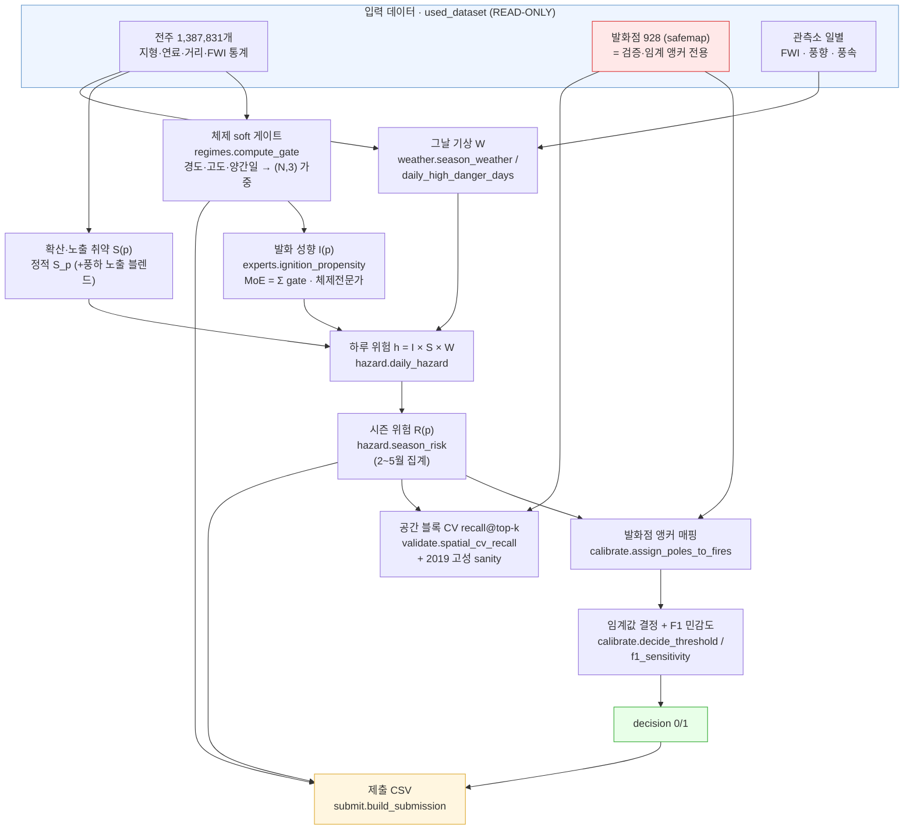
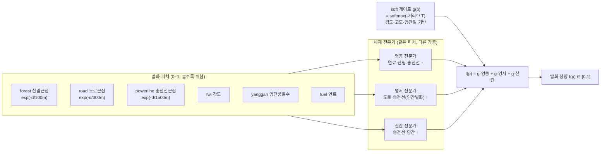
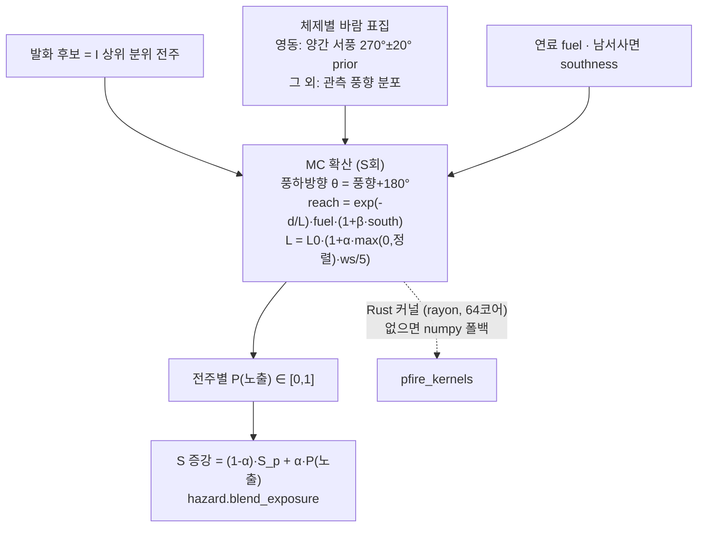

# 전력설비(전주) 산불위험 조기경보 시스템

> **2026 날씨 빅데이터 콘테스트 · 주제1 재난안전** — 기상·공간정보 기반 전력설비 인근 화재 위험도 분석
> 주최 **기상청** · 참여기관 **한국전력공사(KEPCO)**

**한 줄 요약** — 강원도의 가상 전주 **138만 개** 하나하나에 대해 "매일 불이 시작될 성향 × 번질 취약성 × 그날의 기상"을 곱해 일별 위험을 계산하고, 산불조심기간(2~5월)을 모아 전주별 **위험/안전(0/1)** 을 판정합니다. **정답 라벨이 없는 문제**라서, 과거 발화점은 학습이 아니라 **검증·임계값 결정의 기준**으로만 쓰고, 위험 자체는 **산불 물리식 + 지역별 전문가(MoE)** 로 비지도(unsupervised)에 가깝게 추정합니다.

---

## 목차

1. [문제 정의 — 무엇을 풀어야 하나](#1-문제-정의--무엇을-풀어야-하나)
2. [왜 이 프로젝트인가 — 기존 접근의 한계](#2-왜-이-프로젝트인가--기존-접근의-한계)
3. [모델 구조 및 아키텍처](#3-모델-구조-및-아키텍처)
4. [데이터 스펙](#4-데이터-스펙)
5. [설치 및 실행](#5-설치-및-실행)
6. [검증 결과](#6-검증-결과)
7. [제출물 스펙](#7-제출물-스펙)
8. [활용 방안](#8-활용-방안)
9. [로드맵](#9-로드맵)
10. [한계와 가정](#10-한계와-가정)
11. [프로젝트 구조](#11-프로젝트-구조)
12. [참고문헌](#12-참고문헌)

---

## 1. 문제 정의 — 무엇을 풀어야 하나

<p align="center">
  
  
</p>

### 대회가 요구하는 것

- **강원도 가상 전주 1,387,831개** 각각에 `decision` **0/1** (0=안전, 1=위험)을 매겨 **CSV로 제출**합니다.
- 정량 점수(20점)는 **KEPCO가 자체 생성한 비공개 정답**과의 **F1 score**.
- 정성 점수(80점) = 합리성(10) · 데이터 분석능력(20) · 활용성(20) · 창의성(20) · 부합성(10).

> 여기서 "전주(電柱)"는 도시 이름이 아니라 **전봇대(utility pole)** 를 뜻합니다. 대상 지역은 **강원도**입니다.

### 이 문제를 어렵게 만드는 두 가지

**① 정답(라벨)이 없습니다.**
KEPCO 정답은 채점할 때만 쓰이고 우리에게는 주어지지 않습니다. 즉, 일반적인 **지도학습을 쓸 수 없습니다.** 우리가 가진 산불 데이터(safemap 발화점 928건)는 *"불이 난 곳"* 만 기록돼 있고, *"불이 안 난 곳(진짜 음성)"* 은 없습니다. 어떤 전주에 불이 안 난 것이 **정말 안전해서인지, 아직 안 난 것인지** 구분할 수 없습니다. 이는 생태학의 종 분포 모델(**presence-only**), 보안의 침입탐지와 **수학적으로 같은 구조**입니다.

**② 점수의 80%가 정성평가입니다.**
따라서 점수만 잘 나오는 블랙박스가 아니라, **"왜 이 전주가 위험한지 설명되는, 현장에서 쓸 수 있는 시스템"** 이어야 합니다. 물리적으로 말이 되고(부합성), EDA와 일관되며(분석능력), 한전이 실제 순시 우선순위에 쓸 수 있어야(활용성) 합니다.

### EDA가 알려준 사실 (= 모델의 뼈대)

| 발견 | 모델에의 반영 |
|---|---|
| 발화의 **91%가 산림**, **봄(3~5월) 59%** 집중, 원인은 대부분 사람(입산자 실화·소각) | "산림에 가까운 전주"가 핵심 → `dist_to_forest` |
| 불의 **"크기"는 발화지형이 아니라 바람·ISI(초기확산)** 가 좌우 (풍속 ρ=+0.29, ISI +0.26) | 위험 = **발화확률 중심**, 번짐은 **바람 방향** |
| **2019 고성·속초 산불의 발화원 = 특고압선 아크** → 이 과제가 걱정하는 시나리오 | 설비 근접(`dist_to_powerline`)을 발화 성향에 반영 |
| 기상은 전주 단위가 아니라 **~13km 격자 단위**로 영향 (전주→최근접 관측소 중앙값 4.8km) | 전주 고유 변동은 발화항, 기상은 격자에서 공유 |

---

## 2. 왜 이 프로젝트인가 — 기존 접근의 한계

정답이 없을 때 쓰는 정석 방법들을 조사한 결과, 각 방법은 우리 과제에서 다음과 같은 **명확한 한계**를 가집니다.

| 기존 접근 | 한계 (우리 과제 기준) |
|---|---|
| **순수 지수(FWI·ERC·BI)** | 물리 지수만으로는 인간발화·설비발화·연료를 못 담음. 실증적으로 하이브리드 ML보다 F1이 낮음 (지수 0.605~0.704 vs ML 0.776~0.846, Li 2024). |
| **MaxEnt / presence-background** | 간단·해석은 쉽지만 **절대 위험확률을 못 줌**. 양성비율(prevalence)을 데이터만으로 알 수 없어 0.5로 가정 → 산출물은 "확률"이 아니라 **상대 순위(랭킹)** 로 봐야 함. |
| **전 지역 단일 모델** | 영동/영서/산간은 발화·확산 메커니즘이 완전히 다른데, 평균에 묻혀 지역 특성이 사라짐. |
| **지역별 개별 모델** | 데이터가 쪼개져(고성 179, 화천 364건…) 과적합. |
| **무작위 분할 검증** | 산불은 공간 자기상관이 강해 인접 전주가 train/test에 함께 들어가면 **AUC가 5~15% 부풀려짐**(낙관 편향). |

### 우리의 차별점

이 한계들을 정면으로 넘기 위해, 우리는 다음을 결합합니다.

1. **물리식을 본체로** — FWI·연료·발화원 근접 같은 산불 과학 지식을 명시적으로 넣어, 데이터가 적은 곳도 물리가 받쳐 줍니다. → 해석 가능 → 정성점수에 강함.
2. **지역별 전문가 혼합(MoE)** — 전 지역 단일과 개별 모델의 **중간(partial pooling)**. 공유 백본 위에 지역별 가중을 soft하게 섞습니다.
3. **발화점은 학습이 아니라 앵커로** — 귀한 발화점 928개를 **검증·임계값 결정의 기준**으로만 써서 누수를 막습니다.
4. **공간 블록 교차검증** — 무작위 분할의 낙관 편향을 차단하고, "다른 지역에서도 통하는가"를 정직하게 측정합니다.
5. **풍하 확산 MC 시뮬레이션** — 2019 고성 시나리오(서풍 양간지풍→동쪽 확산)를 확률 봉투로 재현해, "흉터 안/밖(0/1)"이 아니라 **노출 기대확률(연속)** 로 영향도를 봅니다.

---

## 3. 모델 구조 및 아키텍처

### 3.1 핵심 아이디어 — 위험을 셋으로 분해

전주 `p`의 **하루치 위험**을 곱셈으로 분해합니다.

```
  h(p, t)  =   I(p)        ×    S(p)        ×    W(grid(p), t)
            발화 성향          확산·노출 취약        그날 기상 노출
            (전주 고정)        (전주 고정)         (격자·매일 변함)
```

**왜 곱셈인가?** 셋 중 하나라도 0이면 위험이 0입니다. 연료 없으면 안 나고, 아무리 마른 산림도 발화원 없으면 시작 안 하고, 비 오는 날은 안 납니다. 물리적으로 맞고, **각 항이 따로 해석돼서** "이 전주는 왜 위험?" → "산림 50m + 송전선 근접 + 4월 FWI 상위" 식으로 설명됩니다.

### 3.2 전체 파이프라인



> 🔴 빨강(발화점)은 **학습에 쓰지 않습니다.** 오직 검증과 임계값 결정에만 들어가 라벨 누수를 막습니다.

### 3.3 발화 성향 I(p) — 지역별 전문가 혼합(MoE)

영동(해안)·영서(내륙)·산간은 발화 메커니즘이 다릅니다. **하드 시군 분할 대신**, 전주 피처(경도·고도·양간일)를 표준화해 체제 앵커와의 거리로 **softmax soft 게이트**를 만들고, 같은 피처를 체제마다 **다른 가중**으로 결합한 전문가들을 혼합합니다.



**체제별 가중은 데이터로 튜닝합니다.** 초기값(EDA 눈대중)은 공간 CV 발화점 recall이 낮았기 때문에, 체제별 6항 가중을 **단순체(simplex)** 로 두고 **LHS(Dirichlet) 랜덤탐색 5,000후보 + 좌표상승**으로 **공간 블록 CV recall@top-k**(홀드아웃)를 최대화했습니다. 결과 provenance는 `outputs/tuned_weights.json`에 기록됩니다. (→ [6. 검증 결과](#6-검증-결과))

### 3.4 확산·노출 취약 S(p) — 풍하 MC 시뮬레이션 (Rust 커널)

기본 `S`는 사전계산된 정적 취약도(`S_p`)지만, 선택적으로 **비등방(풍하) 몬테카를로 확산 프록시**로 증강합니다. 발화 후보(I 상위 분위)에서 시작해, 체제별 바람을 표집(영동은 양간지풍 서풍 prior)하여 N회 시뮬레이션하고, 전주별 **P(노출) = 불이 닿은 시뮬 비율**을 구합니다.



성능 본체는 **Rust(PyO3/maturin)** 입니다. 균일격자 공간 인덱스로 반경 질의를 가속하고, rayon으로 시뮬 축을 병렬화합니다. **N=1.38M, M=2,000, S=256 기준 약 5.9초**(단일스레드 184.5초 대비 **약 31배**). Rust가 없으면 **동일 의미론의 numpy 폴백**으로 end-to-end가 돌아갑니다 (계약: `claudedocs/CONTRACT_rust_python.md`).

### 3.5 그날 기상 W → 시즌 위험 R(p)

- **W (MVP)**: 전주 사전계산 시즌통계 — FWI 강도(0.5) + 고위험일 빈도(0.3) + 양간풍(0.2) 가중 결합.
- **W (일별 엔진)**: 각 전주를 최근접 관측소에 매핑해, 산불조심기간(2~5월) 일별 FWI가 임계(10.0)를 넘은 날 수를 연평균 → 조기경보 프레이밍.
- **시즌 집계**: 단일 W면 `R = I×S×W`. 여러 날이면 일별 `h`의 **기하평균(로그합)** 으로 집계해 단발 고위험일의 과대평가를 완화.

### 3.6 임계값 결정 — F1을 실제로 좌우하는 곳

모델은 **순위**를 주고, **0/1 컷은 별도 결정**입니다. 정답 양성비율 π를 모르므로:

- **F1 민감도 곡선**: π를 0.5%~10%로 바꿔가며 가상 F1·임계값을 함께 보고 → "정답 비율을 몰라도 이 구간에선 안정적"임을 보임.
- **단조 보정(isotonic/PAVA)**: 위험점수 → 사이비 확률로 단조화 (sklearn 미사용, 직접 구현). 해석·보고용.
- **운영 양성비율로 컷 결정**: 기본 2% (한전 점검 capacity 기반 등으로 조정 가능).

---

## 4. 데이터 스펙

전체 데이터 명세는 [`used_dataset/README.md`](used_dataset/README.md)에 정리돼 있습니다 (스냅샷 2026-06-18, **23개 파일 / 423MB**). 산불 데이터는 **safemap 전용**(FIRMS 미사용)이며, 결과물·예보(fwi_grid)는 제외합니다. `used_dataset/`은 **READ-ONLY**이며 `.gitignore`로 저장소에서 제외됩니다.

핵심 입력만 추리면:

| 구분 | 파일 | 행수 | 용도 |
|---|---|---|---|
| 전주 | `pole_features.parquet` | 1,387,831 | 지형·연료·`dist_to_forest`·FWI 통계 (기준 테이블) |
| 전주 | `pole_power.parquet` | 1,387,831 | `dist_to_powerline` / `dist_to_substation` (설비발화) |
| 전주 | `pole_static_overlay.parquet` | 1,387,831 | `mu_*`, `S_p` (확산취약 사전계산) |
| 전주 | `pole_sgg.parquet` / `pole_fwi_obs.parquet` | 1,387,831 | 시군 매핑 / 관측기반 전주 FWI |
| 발화 | `safemap_positives.parquet` | 928 | **발화점 — 검증·임계값 앵커 전용** |
| 기상 | `fwi_station_daily.parquet` / `aws_obs_daily.parquet` | 377,822 | 관측소 일별 FWI·풍속 / 풍향 (MC 풍향 표집) |
| 기상 | `aws_stations_coords_elev.csv` | 109 | 관측소 좌표 (최근접 매핑) |

- **좌표계**: 입력 EPSG:4326(위경도). 거리/확산 계산은 강원 대표 위도(37.7°) 기준 cos 보정 **평면 근사 km**로 변환 (`pfire/geo.py` 단일 구현).
- **데이터 무결성**: 모든 전주 parquet은 `pole_id` 0..1,387,830으로 정렬·정합되어 있으며, 로더(`pfire/io.py`)와 제출 검증(`pfire/submit.py`)이 행수·정렬·유일성을 **강제 검증**합니다. 소수 결측(ndvi/s2 각 3개 등)은 전역 중앙값으로 채우고 그 개수를 로깅합니다.

---

## 5. 설치 및 실행

### 환경 설정 ([uv](https://github.com/astral-sh/uv))

```bash
# Python 3.12+, 의존성 동기화
uv sync

# (선택) Rust 풍하 확산 커널 빌드 — 없어도 numpy 폴백으로 동작
uv pip install maturin
cd rust/pfire_kernels
PATH="$HOME/.cargo/bin:$PATH" ../../.venv/bin/maturin develop --release
```

### Phase-1 MVP 실행

```bash
# 로드 → I(MoE) → S → W → R → 임계값 → 공간CV/sanity → submission.csv
.venv/bin/python scripts/run_phase1_mvp.py --prevalence 0.02

# 일별 엔진(W = 관측소 일별 FWI 고위험일)로
.venv/bin/python scripts/run_phase1_mvp.py --daily-weather

# 풍하 노출 실연동(Rust 커널) + 방향 sanity
.venv/bin/python scripts/run_phase1_mvp.py --exposure --exposure-alpha 0.0
```

출력: `outputs/submissions/submission.csv`.

### 체제 가중 튜닝 (Phase-2)

```bash
# 공간블록 CV recall 목적함수로 EXPERT_WEIGHTS 재튜닝 → outputs/tuned_weights.json
.venv/bin/python scripts/tune_weights.py --n-random 5000 --workers 60
```

### 테스트

```bash
.venv/bin/python -m pytest tests/ -q   # 데이터 없이도 도는 합성입력 단위테스트 36개
```

---

## 6. 검증 결과

정답 라벨이 없어도 **과거 발화점**으로 간접 검증하되, **공간 자기상관 누수**를 막는 것이 핵심입니다.

### 공간 블록 교차검증 (10km 블록 GroupKFold)

체제 가중 튜닝 전/후 발화점 **recall@top-k** (홀드아웃, 강원 전체):

| 지표 | 튜닝 전 (EDA 눈대중) | 튜닝 후 |
|---|---|---|
| recall@top-1% | 0.013 | **0.022** |
| recall@top-2% | 0.028 | **0.042** |
| recall@top-5% | 0.077 | **0.100** |
| recall@top-10% | 0.146 | **0.171** |

- **튜닝 방법**: LHS(Dirichlet) 랜덤탐색 5,000후보 + 좌표상승, simplex를 0.05 격자로 양자화(미세과적합 회피), 목적=공간CV recall@top-{1,2,5,10}% 가중평균.
- **낙관 편향 감시**: 무작위분할 vs 공간분할 recall **격차 ≈ 0** (top-5%에서 -0.018, 즉 부풀림 없음).
- **재현 안정성**: 5개 폴드시드 반복 std ≈ 0.005~0.008.

### Sanity 체크 — 2019 고성 산불

- **위치**: 고성 발화점(128.50°E, 38.21°N) 인근 전주가 고위험 상위에 오는지 확인.
- **방향성**: 풍하 노출이 실제 burn-scar 방향(서→동, ~6.7km)으로 신장되는지(`east_frac > 0.5`) 확인.

---

## 7. 제출물 스펙

<p align="center">
  
</p>

제출 CSV는 **필수 4칸 + 해석용 추가 컬럼**으로 구성됩니다. 무결성(행수 1,387,831 · `decision` 0/1만 · `pole_id` 정렬·유일)을 `pfire/submit.py`가 강제 검증합니다.

| 컬럼 | 구분 | 설명 |
|---|---|---|
| `pole_id`, `lon`, `lat`, `decision` | **필수** | 전주 식별/좌표 + 0/1 결정 |
| `risk_score` | 추가 | 단조 보정 위험 점수 |
| `regime` | 추가 | 우세 체제(영동/영서/산간) — 왜 위험한지 |
| `p_exposure` | 추가 | 풍하 노출확률 |
| `unc_lo`, `unc_hi` | 추가 | 불확실성 밴드(관측소 거리·외삽 기반) |

추가 컬럼으로 **"왜·얼마나 확신하는지"** 까지 전달해 정성평가(활용성·창의성)에 대응합니다.

---

## 8. 활용 방안

한전 실무의 **"우선순위 선정 모델"** 에 정확히 부합합니다.

- **일별 조기경보** — 고위험일 풍하 고위험 전주 → 당일 순시·예찰 우선순위 자동 생성.
- **시즌 보강 계획** — 시즌 `R(p)` 상위 전주 → 절연 보강·수목 제거(line clearance) 대상 선정.
- **불확실성 활용** — "위험하지만 불확실"한 전주는 현장 확인 1순위(능동 라벨 수집) → 다음 시즌 모델이 더 똑똑해지는 선순환.
- **실사례 근거** — 같은 패러다임으로 PG&E는 2022년 배전선 보고대상 발화 **68% 감소**(Technosylva FireSim). 본 시스템은 그 강원·전주 버전의 경량판.

---

## 9. 로드맵

현재(Phase 1~2)는 **물리식 + MoE + 튜닝 가중 + MC 노출**로 baseline 제출이 가능합니다. 아래는 정성점수를 끌어올리는 **차별화 레이어**로, 단계적으로 쌓습니다.

| 단계 | 내용 | 상태 |
|---|---|---|
| 1. 물리 사전점수 + 일별 W | FWI×연료×발화원 → baseline 위험맵 | ✅ |
| 2. 발화 성향 I(p) + 가중 튜닝 | MoE + 공간CV recall 최적화 | ✅ |
| 3. 풍하 확산 S(p) | MC 노출 시뮬(Rust), dNBR 방향 sanity | ✅ |
| 4. FiLM 계층 + FiLM-Ensemble | 지역 조건부 변조 + 단일망 암묵 앙상블(인식 불확실성) | 🔜 |
| 5. 컨포멀 예측 | 분포가정 없는 커버리지 보장 임계값 | 🔜 |
| 6. PU 학습(nnPU) | 발화점=양성, 층화 배경=미분류 딥 PU로 I 보강 | 🔜 |

> 설계 근거와 리서치 출처는 [`claudedocs/기획서_전주산불위험_조기경보_20260618.md`](claudedocs/기획서_전주산불위험_조기경보_20260618.md)에 정리돼 있습니다.

---

## 10. 한계와 가정

- **절대 확률이 아님** — presence-only 특성상 산출물은 **상대 순위**입니다. 0/1 컷은 양성비율 가정에 의존하며, F1 민감도 곡선으로 그 의존성을 투명하게 보고합니다.
- **발화 후보 가정** — MC 노출의 발화원은 발화점 라벨이 아니라 "I 상위 분위 = 위험 환경에서 불이 시작된다"는 가정으로 둡니다.
- **풍하 노출 블렌드 기본 off** — 현재 발화 앵커가 인간발화 위주라, 노출 블렌드(α>0)는 공간CV recall을 낮출 수 있어 기본 `--exposure-alpha 0`(결정엔 미반영, 산출·sanity만). 보고서에 항상 전/후를 비교합니다.
- **평면 근사** — 거리/확산은 강원 위도 기준 cos 보정 평면 km. 광역 강원에서 충분하지만 위경도 정밀 측지는 아님.

---

## 11. 프로젝트 구조

```
OR-project/
├── pfire/                      # 위험 추정 파이프라인 (단일 진실: config.py)
│   ├── config.py               # 경로·상수·체제·시즌·시드·튜닝가중 한 곳에
│   ├── io.py                   # polars 마스터 프레임 조인 + 무결성 검증
│   ├── geo.py                  # lon/lat ↔ 평면 km 단일 변환
│   ├── regimes.py              # 체제 soft 게이트 (MoE)
│   ├── experts.py              # 체제별 물리식 전문가 → I(p)
│   ├── weather.py              # 시즌/일별 기상 W
│   ├── exposure.py             # 풍하 노출 (Rust 래퍼 + numpy 폴백)
│   ├── exposure_engine.py      # 발화후보·바람표집·체제결합
│   ├── hazard.py               # h = I×S×W, 시즌 집계 R(p)
│   ├── calibrate.py            # 발화점 앵커·단조보정·F1 민감도·임계값
│   ├── validate.py             # 공간 블록 CV·sanity·낙관편향 진단
│   └── submit.py               # 제출 CSV 구성 + 스키마 강제 검증
├── rust/pfire_kernels/         # MC 풍하 확산 커널 (PyO3/maturin, rayon)
│   └── src/{lib.rs, grid.rs}   # 시뮬 코어 + 균일격자 공간 인덱스
├── scripts/
│   ├── run_phase1_mvp.py       # end-to-end MVP 실행
│   └── tune_weights.py         # 체제 가중 공간CV 튜닝
├── tests/test_units.py         # 합성입력 단위테스트 36개
├── claudedocs/                 # 기획서 + Rust↔Python 인터페이스 계약
├── ebook_pages/                # 대회 설명자료(이미지)
├── notebooks/EDA.ipynb         # 탐색적 데이터 분석
└── used_dataset/               # 입력 데이터 (READ-ONLY, gitignore)
```

---

## 12. 참고문헌

- 산불 발화 = presence-only, 공간·시간 층화 배경표집: [Springer Natural Hazards 2023](https://link.springer.com/article/10.1007/s11069-023-06172-x)
- PU 학습 / non-negative risk estimator(nnPU): [Kiryo et al., NeurIPS 2017](https://arxiv.org/abs/1703.00593)
- presence-only는 절대 prevalence 불가(MaxEnt 기본 0.5): [Phillips & Dudík 2008](https://www.whoi.edu/cms/files/phillips_dudik_2008_53466.pdf)
- 물리-하이브리드가 지수·순수ML보다 정확·해석가능: [Li et al. 2024, Earth's Future](https://agupubs.onlinelibrary.wiley.com/doi/full/10.1029/2024EF004588)
- FiLM(조건부 변조): [Perez et al., AAAI 2018](https://arxiv.org/abs/1709.07871) · FiLM-Ensemble: [Turkoglu et al., NeurIPS 2022](https://arxiv.org/abs/2206.00050)
- 컨포멀 예측(분포가정 없는 커버리지 보장): [arXiv:2306.00876](https://arxiv.org/html/2306.00876v2)
- 공간 블록 CV 필수(무작위 분할 AUC 5~15% 과대): [arXiv:2303.07334](https://arxiv.org/pdf/2303.07334)
- 전력설비 산불 조기경보 실사례(PG&E 발화 68%↓): [Technosylva](https://technosylva.com/products/wildfire-operations/)
</content>
