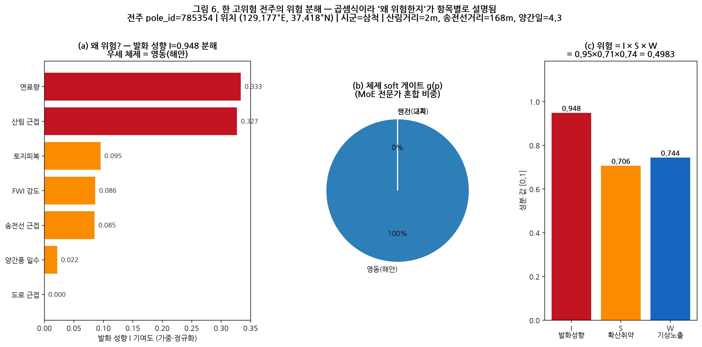

# 전주 산불위험 조기경보 — 시각자료 & 활용방안 (정성평가 요약)

**작성** 2026-06-19 · **용도** 6쪽 hwpx 제출의 토대 (그림 + 한 줄 설명 중심)
**대상 과제** 2026 날씨 빅데이터 콘테스트 주제1(재난안전) — 기상·공간정보 기반 전력설비 인근 화재 위험도 분석(KEPCO)

> 상세 설계·문헌 근거는 `README.md` / `claudedocs/기획서_*`에 있습니다. 이 문서는 **그림으로 "무엇을·왜·결과를" 한눈에** 전달하는 요약본입니다. (그림 원본: `outputs/figures/*.png`, 300dpi)

---

## 0. 문제 — 한 줄

> **강원 가상 전주 1,387,831개** 각각에 "산불 위험/안전(0/1)"을 매겨야 한다. 그런데 **정답 라벨이 없다** (KEPCO 정답은 채점에만 사용). 따라서 과거 발화점은 학습이 아니라 **검증·임계값 앵커**로만 쓰고, 위험 자체는 **산불 물리식 + 지역 전문가 혼합(MoE)** 으로 비지도에 가깝게 추정한다. 점수의 **80%가 정성평가**라 "왜 이 전주가 위험한지"가 설명돼야 한다.

---

## 1. 방법 — 한 그림: 위험 = 발화 × 확산 × 기상

전주 `p`의 하루치 위험을 **곱셈으로 분해**한다 (美 산불위험 독트린 likelihood×intensity=hazard와 동형):

```
  h(p,t) = I(p) × S(p) × W(grid, t)
           발화성향   확산취약    그날 기상노출
```

셋 중 하나라도 0이면 위험이 0 (연료 없으면 안 나고, 발화원 없으면 시작 안 하고, 비 오면 안 난다). **각 항이 따로 해석돼서** "이 전주는 왜 위험?"에 항목별로 답할 수 있다 → 아래 **그림 6**이 그 분해의 실제 예시다.

지역(영동/영서/산간)마다 발화 메커니즘이 달라, 발화 성향 `I(p)`는 전주 피처(경도·고도·양간일)로 만든 **soft 게이트**가 체제 전문가를 혼합하는 **MoE**로 추정한다(전역 단일·지역별 개별의 중간 = partial pooling).

---

## 2. 결과 (정직하게)

### 그림 1 — 강원 위험지도: 위험 전주는 어디 몰리나


- (a) 전주 138만 개를 **위험 점수**로 색칠. 위험은 **산림 인접·해안(영동)·내륙 경계**에 군집한다.
- (b) **위험 판정(decision=1) 27,757개**(상위 2%)와 **과거 발화점**(검증 앵커, 별★)을 겹쳐 표시.
- **메시지**: 위험이 강원 전역에 균일하지 않고 **특정 회랑에 집중** → 한전 순시 우선순위화의 출발점.

### 그림 2 — 지역 체제(MoE)와 편중 완화 (주된 운영 이득)


- (a) soft 게이트가 전주를 **영동/영서/산간**으로 자동 분류 (시군 하드분할 아님 → 경계 전주는 자연 블렌딩).
- (b) **전역 단일컷**으로 상위 2%를 뽑으면 위험 전주의 **94%가 영동 한 곳에 쏠린다**. **체제별 컷**(각 체제 내 2%)으로 바꾸면 **영동 22% / 영서 48% / 산간 30%**로 균형 잡히고, 각 체제 양성률이 **≈2.0%로 균일**해진다.
- **메시지**: 이것이 **이번 개선의 주된 이득**이다 — recall은 그대로 두고(아래 그림 3), 한 지역이 점검 자원을 독식하는 비현실적 배분을 고쳐 **운영 타당성**을 높인다.

### 그림 3 — 발화점 recall@top-k (정직한 성능)


- 공간 블록 CV(10km GroupKFold) 기준 발화점 recall: **상위 5%에서 0.10 (랜덤 0.05의 약 2배)**, 상위 10%에서 0.18.
- **전역컷 ≈ 체제별컷** — 체제별로 균형화해도 recall을 거의 해치지 않는다(중립~소폭).
- **낙관편향 감시**: 무작위분할 0.089 vs 공간분할 0.101, **격차 ≈ 0** → 공간 자기상관 누수로 성능을 부풀리지 않았다는 직접 증거(Ploton 2020 함정 회피).
- **한계 명시**: recall 절대값이 낮은 것은 **발화점이 희소(706개 매핑)하고 인간발화 위주**라 천장이 앵커에 묶여 있기 때문. 산출물은 절대확률이 아니라 **상대 순위(랭킹) 도구**로 해석해야 한다.

### 그림 4 — 임계값 민감도: "정답 비율 몰라도 robust"


- 정답 양성비율 π를 모르므로, π를 **0.5~10%**로 바꿔가며 proxy-F1·recall을 함께 보고한다.
- 곡선이 **단조·안정적**이고, 전역·체제별 모두 랜덤 기준선을 상회 → **π를 정확히 몰라도 운영 거동이 흔들리지 않는다.**
- **권장 운영점 π=2%**(한전 점검 capacity 기반)를 표시. 예산이 늘면 recall이 자연히 오른다.

### 그림 5 — 2019 고성 케이스: 흉터 방향과 정합


- **2019 고성-속초 산불**(발화원 = KEPCO 특고압선 아크, 2023 법원 배상 인정)의 **dNBR 흉터**가 **발화점(서)→풍하(동)로 ~6.7km 신장**됨을 보인다.
- 인근 전주의 위험 점수도 **같은 서→동 축**을 따라 분포 → 모델의 양간지풍 발화·확산 가설과 **정합**.
- 고성권 전주(3,465개)의 평균 위험 percentile은 **0.60**(중앙값 위) — sanity로서 "그 시나리오 지역이 상위에 온다"를 확인. **정직**: 흉터 자체는 대부분 산림이라 흉터 내부에 decision=1 전주는 적고(전주는 마을·도로변 가장자리에 군집), 그래서 **연속 위험 점수**로 동향을 본다.

### 그림 6 — 발화 분해: "왜 이 전주가 위험한가"



- 한 고위험 전주(삼척, 산림거리 2m·송전선거리 168m)의 발화 성향 `I`를 **피처별 기여**로 분해.
- **연료(0.333) + 산림근접(0.327)** 이 위험을 지배하고, 체제 게이트는 **영동 100%**(해안 양간지풍 체제) → 곱셈식 `I×S×W = 0.95×0.71×0.74 ≈ 0.50`.
- **메시지**: 블랙박스가 아니라 **"산림 코앞 + 연료 많음 + 영동 체제"** 처럼 현장에서 검증 가능한 이유로 위험을 설명한다(부합성·활용성).

---

## 3. 활용방안 — 한전 "우선순위 선정 모델"에 부합

| 활용 | 무엇을 | 어떻게 |
|---|---|---|
| **일별 조기경보** | 고위험일 풍하 고위험 전주 | `W`를 매일 갱신 → 당일 순시·예찰 우선순위 자동 생성 |
| **시즌 보강 계획** | 시즌 위험 `R(p)` 상위 전주 | 절연 보강·수목 제거(line clearance) 대상 선정 |
| **불확실성 활용** | "위험하지만 불확실"한 전주(`unc_lo/hi` 폭 큼) | 현장 확인 1순위 → 능동 라벨 수집 → 다음 시즌 모델 개선 선순환 |
| **지역 형평 배분** | 체제별 컷(그림 2) | 한 지역 독식 방지, 영동/영서/산간 균형 점검 |

- **실사례 근거**: 같은 패러다임(앙상블 연소확률 시뮬)을 운영하는 PG&E는 2022년 배전선 보고대상 발화가 전년 대비 **68% 감소**(단, 지중화·수목관리 포함 **프로그램 전체 성과**). 본 시스템은 그 패러다임의 **강원·전주 경량판**이다.

---

## 4. 한계 (과장 없이)

- **절대 확률이 아님** — presence-only 특성상 산출물은 **상대 순위**. 0/1 컷은 양성비율 가정에 의존하며, 그 의존성을 **그림 4**로 투명하게 보고.
- **recall 천장** — 발화점이 희소(706개)·인간발화 위주라 recall@top-5%≈0.10(랜덤 2배)이 현재 천장. 미래 라벨 축적으로 개선 여지.
- **체제별 컷의 이득은 recall이 아니라 운영 타당성** — recall은 중립~소폭, 주된 이득은 **편중 95%→균등** 교정(그림 2).
- **계층 EB·풍하 노출 블렌드는 decision에 미반영** — 누수 안전 검증에서 recall을 개선하지 못해 **decision은 off**, 구조·정성 가치(설명력·창의성)로만 보존(README 10장과 일치).
- **평면 근사** — 거리/확산은 강원 위도 cos 보정 평면 km(광역엔 충분, 정밀 측지는 아님).

---

### 부록 — 그림 재생성

```bash
.venv/bin/python scripts/make_figures.py   # → outputs/figures/*.png (300dpi, 6장)
```

근거 데이터: `outputs/submissions/submission.csv`, `outputs/regime_threshold_analysis.json`, `outputs/tuned_weights.json`, `used_dataset/`(READ-ONLY). 파이프라인(`pfire/`)은 **읽기만** 사용(그림 6의 I·게이트 계산).
