# 기상·공간정보 기반 전력설비 인근 산불위험 분석
## 물리 혼합전문가(MoE)와 양간지풍 풍하노출의 결합 — MOSAIC

> 2026 날씨 빅데이터 콘테스트 · 주제1(재난안전) · 최종 공모안
> 결과물: `접수번호.csv` (가상전주 1,387,831본 위험여부 0/1)
> ※ 공식 양식(1~5절, hwpx 6쪽 이내). 그림은 `outputs/figures/` 참조.

---

## 1. 분석 배경 및 목표

강원은 산불조심기간인 봄철(2~5월), 특히 3~5월에 이동성 고기압에 따른 건조·강풍과 태백산맥을 넘는 푄(föhn) 현상인 양간지풍(양양–고성 회랑, 풍속 20 m/s급)이 겹쳐 대형 산불 위험이 높은 지역이다. 전력설비(전주·송전선)는 잠재 발화원이자, 강풍 확산의 피해 대상이다. 2019년 고성 산불은 한전 특고압 전선의 아크가 발화원이 되어 양간지풍을 타고 대형으로 번진 설비발화 사례다. 한국전력공사는 설비 산불 위험성에 기반한 우선순위 모델로 고위험 지역의 점검·보강을 운영한다.

분석의 핵심 제약은 학습용 정답 라벨의 부재다. 검증용 정답(전주별 실제 위험 여부)은 비공개이며, 참가자에게는 과거 발화 이력만 제공된다. 위험 사례 일부만 관측될 뿐 비위험을 규정할 근거가 없는 presence-only 구조다. 발화 사건 또한 희소하다. 강원 산불은 최근 3년 166건, 분석에 활용 가능한 발화점은 10년 누적 900여 건에 그치는 반면, 위험을 판정할 가상전주는 1,387,831본에 이른다. 발화점 한 곳이 반경 내 다수 전주에 중복 귀속되므로, 단순 근접 라벨만으로는 전주 간 변별이 어렵다.

목표는 가상전주 1,387,831본 각각의 산불위험 여부를 0/1로 판정하는 것이다. 위험은 설비 자체의 발화(예: 2019 고성)에 더해, 입산·소각 등 다른 원인의 산불이 전주로 번지는 경우까지 포괄한다(전주는 발화원이자 피해 대상). 영동·회랑·영서·산간 등 권역별로 위험 지배요인이 다른 점을 반영하되, 동일 권역 내에서도 전주 단위로 위험을 변별한다. 대다수 산불 위험 모델이 점추정에 그친 것과 달리, 각 판정에 베이지안 사후와 conformal 커버리지로 불확실성을 부여한다.

---

## 2. 분석 데이터 및 전처리

**제공 데이터.** 가상 전력설비 위치 `(pole_id, lon, lat)` 1,387,831본(접경지역 제외, EPSG:4326).

**수집·결합한 외부 데이터.**
| 구분 | 데이터 | 용도 |
|---|---|---|
| 기상(시계열) | 기상청 AWS 일별 관측·일별 FWI(FFMC·DMC·DC·ISI·BUI·FWI, 2015~), 양간지풍 일수 | 기상 위험 W |
| 공간(정적) | 지형(고도·경사·사면), 토지피복, 위성식생(NDVI·NBR·NDMI), 도로·송전선·변전소 거리 | 발화기하·연료·노출 S |
| 발화이력(외부) | 산림청 FFAS 산불발생대장(강원) 발화점 좌표·발생시각 | PU 양성(P)·검증 앵커 |

**전처리.**
- 게이트 피처 표준화: 경도·고도·양간일수 z-표준화(체제 soft 배정용).
- 발화점→전주 매핑: 반경 1 km 내 전주에 발화 귀속. 발화 라벨은 학습 타깃이 아니라 검증·임계 앵커로 사용(누수 차단).
- 공간 블록(10 km): 공간 자기상관에 의한 평가 편향을 줄이는 블록 교차검증 폴드.
- FFAS 좌표는 지번 중심점이므로 점이 아닌 면으로 취급하고, 원인·피해 필드는 결측·시기편향으로 제외하여 좌표·발생시각만 사용한다.

**탐색적 분석(EDA).** `notebooks/EDA.ipynb`(전주·발화점 분포·발화원인·기상 커버리지)와 파생분석(`eda_derived`: I·S·W 분산기여·체제 분포·공간상관)으로 다음 설계 근거를 데이터로 확인했다.

- 발화점·전주 분포 차이: 발화점의 91%는 산림에 있지만, 전주는 농업 37.0%·초지 21.3%·산림 17.9%·시가화 17.3%로 넓게 분포한다. 따라서 단순 산림 여부가 아니라 **산림 인접 전주**와 토지피복·연료·도로·송전선 접근성을 결합해야 한다.
- 위험 분해 \(R=I\cdot S\cdot W\): 전역 분산기여 I 0.52·W 0.40·S 0.08이며, 체제마다 지배항이 다르다(영동=W, 회랑=S(풍하), 영서·산악=I) — 곱셈 분해와 지역 MoE 분할의 근거(그림 1).
- 체제 분리: 영동은 양간일수·FWI·위험R이 다른 체제보다 높다(그림 2).
- 확산 요인: 화재당일 풍속 ρ=+0.29, 관측 ISI ρ=+0.26(n=135, 유의). 화재 크기는 발화점 지형보다 바람·초기확산과 연관 — 풍하노출 항의 근거.
- 공간 자기상관: 위험이 공간적으로 군집(Moran's I)하여 공간 블록 교차검증을 채택.
- 발화 원인 분포: 입산자 실화 34%·쓰레기 소각 18% 등 인적 요인이 대부분이고, 전기·설비는 27건(3%, §4E 모델 분류로는 24건)으로 소수다(그림 3) — 전주 위험이 설비발화에 국한되지 않음을 뒷받침.
- 기상 커버리지: 관측소 109지점(ASOS 15+AWS 94), 전주→최근접 관측소 거리 중앙값 4.8 km·10 km 초과 7.7%로 전주 시즌기상 보간이 충분하다(그림 4).

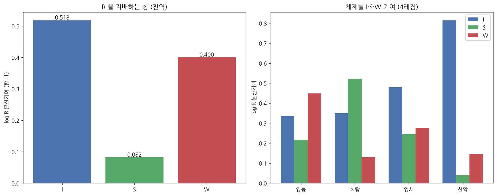

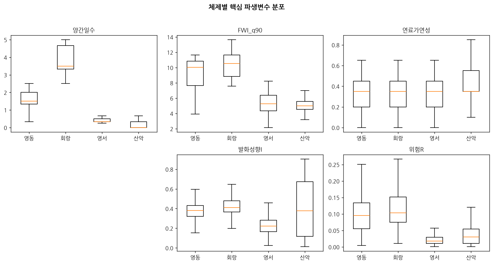

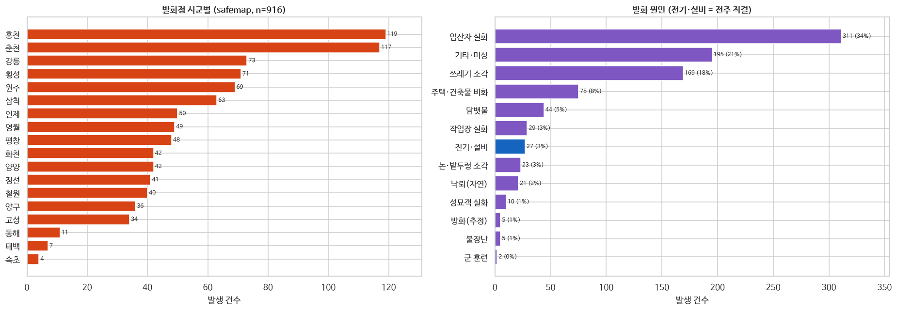

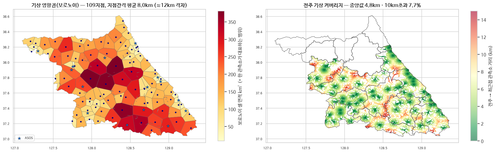

---

## 3. 분석방법

전주 *p*의 위험을
$$ R(p) = I(p)\cdot S(p)\cdot W(p) $$
로 분해한다. I=발화 성향, S=정적 취약·풍하노출, W=기상·계절이며, 세 항이 함께 클 때 위험이 높다.

**(1) 발화 성향 I — 지역 혼합전문가(MoE, Mixture of Experts).** 강원은 지역마다 발화 메커니즘이 달라(영동=가뭄, 회랑=바람, 영서=인적, 산악=연료) 단일 규칙으로 설명되지 않는다. 이에 **지역별 전문가(expert)**를 두고, 전주 위치에 따라 **어느 전문가의 판단을 얼마나 따를지(게이트, gate)**를 정하는 혼합전문가 구조를 사용한다.

권역은 **태백산맥을 경계로 영동(해안)·영서(내륙)**로 갈린 뒤, 영동에서 양간지풍이 집중되는 **양양–고성 통로를 회랑**으로, 고도가 높은 지대를 **산악**으로 분리해 4개 레짐으로 둔다. 이 분할이 게이트 축인 **경도(동–서)·고도(산악)·양간일수(회랑)**와 대응하므로, 전주 위치만으로 자기 레짐의 전문가에 부드럽게 배정된다. 네 권역으로 가른 근거는 권역 간 지배 위험항과 핵심 변수 분포가 뚜렷이 갈린다는 데 있다(그림 1·2).

- **전문가(expert)**: 각 레짐이 동일한 피처(산림거리·도로·송전선거리·FWI·양간일수·연료가연성·토지피복)를 서로 다른 가중 \(w_{rj}\)으로 결합한 그 지역의 발화 규칙.
- **게이트(gate)**: 전주의 위치피처 \(z_p=(\text{경도, 고도, 양간일수})\)와 레짐 중심 \(\mu_r\)의 거리로 4개 전문가에 대한 가중(합=1)을 softmax 산출. 경계 전주는 두 전문가에 분산(블렌딩)되어 하드 분할의 MAUP을 피한다.

| 레짐 | 지역 | 발화 구동인자 | 지배 위험항(그림 1) |
|---|---|---|---|
| 영동 | 강릉·동해·삼척 | 가뭄·FWI | 기상 W |
| 회랑 | 양양·고성·속초 | 양간지풍·송전선 | 풍하노출 S |
| 영서 | 내륙 | 인적발화(소각·입산자) | 발화 I |
| 산악 | 고지 | 연료·도로 접근 | 발화 I |

$$ \underbrace{g_r(p)=\frac{\exp(-\lVert z_p-\mu_r\rVert^2/\tau)}{\sum_{r'}\exp(-\lVert z_p-\mu_{r'}\rVert^2/\tau)}}_{\text{게이트: 어느 전문가를 따를지}},\qquad \underbrace{I(p)=\sum_{r}g_r(p)\sum_{j}w_{rj}\,f_j(p)}_{\text{전문가 판단의 가중 합}}. $$

즉 발화성향 I는 전주마다 자기 지역에 맞는 전문가 조합으로 산출된다(그림 1의 체제별 지배항 차이가 이 구조의 근거).

**(2) 양간지풍 풍하노출 S — 확산(spread) 모형.** 양간지풍은 발화가 아니라 *확산*을 일으키는 바람이다. 서쪽에서 시작된 발화가 양간지풍(서풍 prior ≈270°)을 따라 동쪽으로 번지는 과정을 몬테카를로(\(S\!=\!256\) 시뮬, 이방성 풍하 커널)로 모사하여, 각 전주가 풍하 커널에 도달하는 확률 \(P_{\text{exp}}\)을 산출한다. 이를 정적 취약 \(S_0\)에 조건부 강도 \(\alpha_p\)(영동·회랑 게이트×양간강도)로 블렌딩한다:
$$ P_{\text{exp}}(p)=\tfrac1S\textstyle\sum_{s=1}^{S}\mathbb{1}\!\left[p \text{가 풍하 커널에 도달}\right],\qquad S(p)=(1-\alpha_p)\,S_0(p)+\alpha_p\,P_{\text{exp}}(p). $$
그림 5는 이 풍하노출 dose를 강원 전역에 산출한 결과로, 양간지풍 회랑(양양–고성)의 풍하(동측)가 높게 변별된다.

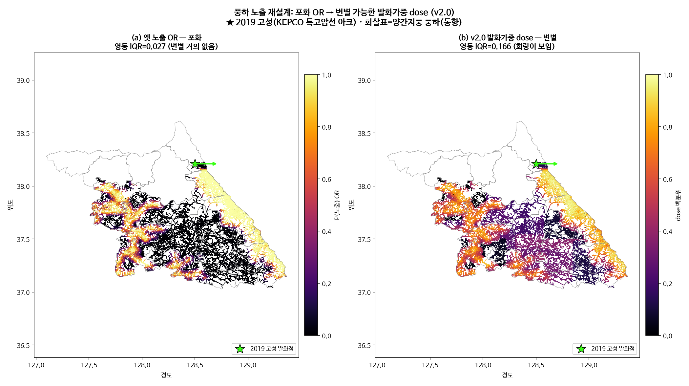

**(3) 기상 W.** 전주별 시즌 FWI·풍속·실효습도 통계에 일별 동역학(ISI·FFMC)을 결합한다.

**(4) 지역율 보정·불확실성.** 격자 발화수 \(y\)·노출 \(E\)에 발생률 사후 \(\lambda\sim\Gamma(\alpha_0+\sum y,\ \beta_0+\sum E)\)를 두고, 공간 CAR로 이웃 정보를 빌리는 BYM2를 채택한다(독립 Poisson-Gamma는 비교 baseline).
$$ \lambda \sim \Gamma(\alpha_0+\textstyle\sum y,\ \beta_0+\textstyle\sum E)\ \Rightarrow\ \text{credible }[\,r_{lo},r_{hi}\,]\ (\text{90\%}). $$
발화 0 격자가 이웃 위험을 반영하는 BYM이 공간상관을 더 매끄럽게 표현한다(Moran's I 0.098→0.112; 그림 6). 사후를 물리 base risk에 MC 전파해 전주별 90% credible `risk_lo/hi`를 산출하되, 이는 0/1 결정에는 쓰지 않고 운영 보조 산출물로 사용한다.

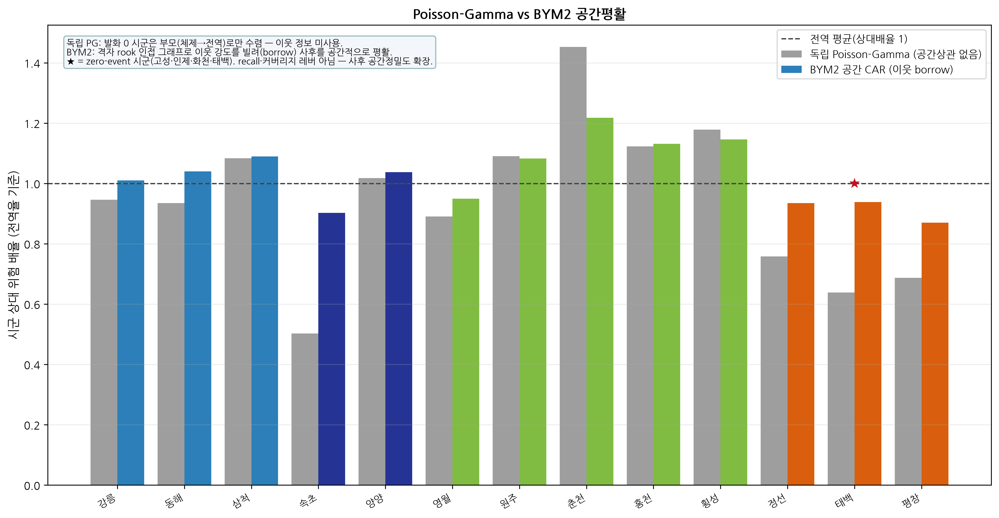

**(5) 학습 — within-regime 목적함수.** 가중 튜닝의 목적을 전역 top-k recall이 아니라 레짐별 within recall의 동일가중 평균으로 둔다. 전역 목적은 발화 빈도가 높은 영동을 우선하는 between-regime 기저율 효과를 보상하여 레짐 내 변별을 약화시킨다(4절).

**(6) 결정 — regime-anchor 배분.** 전역 단일 컷이 영동에 집중되는 것을 막기 위해, 체제별 발화앵커밀도 비례로 양성 예산을 배분한 뒤 레짐 내 위험순위로 컷을 둔다.

---

## 4. 결과 및 검증

**(A) within-regime 진단.** 전역 AUC는 0.63이나 레짐 내부로 보면 ≈0.5로, 모델이 지역은 구분하되 전주 단위 변별은 약했다. 목적함수를 within으로 전환한 결과:

| 지표 | 전역 목적 | within 목적(채택) |
|---|---|---|
| within-regime AUC(전체) | 0.488 | 0.560 |
| 회랑 within AUC | 0.45 | 0.52 |
| 전역 top5% recall | 0.097 | 0.071 |

within 목적 채택 후 16개 시군 모두에서 전주 단위 위험 그라데이션이 확보된다(그림 7): 영동·회랑·산악 시군은 평균위험이 높고(70~85), 영서 내륙은 낮아(9~40) 레짐 구조가 드러나며, 동일 시군 내부에서도 전주별 변별이 함께 나타난다.

**(B) 발화시점 기상 검증(케이스-크로스오버).** 별도 발화시점 검증에서 발생일을 같은 관측소·계절의 비발화일과 대조하여 발화일이 위험기상일인지를 AUC로 측정했다.
- 영동 FWI 0.725, ISI 0.698, 회랑 풍속 0.664 — 기상신호 존재.
- 영서 풍속 0.51(무변별). 영서는 주말 발화 비중이 영동의 약 2배로 인적발화 성격이 강하다 — 레짐별 피처 차등의 근거.

**(C) 확산 검증 — 2019 고성·속초 송전선 산불.** 실제 산불 흉터(Sentinel-2 dNBR)가 모델의 양간지풍 풍하 방향과 일치하는지 확인했다.
- **확산 방향**: 발화점(서쪽)에서 실제 흉터가 동쪽으로 ~6.7 km 번졌다. 모델 풍하 노출 방향 `east_frac=0.99`(서풍→동쪽)와 일치(그림 8).
- **위험 포착**: 5 km 인근 전주 평균 위험백분위가 회랑 레짐 + 풍하노출 적용 시 **0.90**(top10% 비율 64.6%).

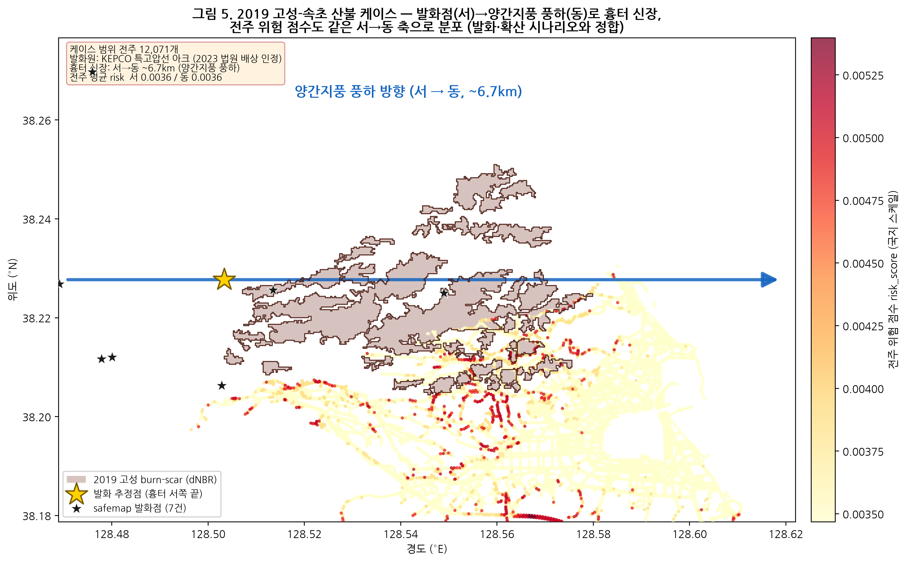

**(D) 공간 블록 CV·운영점.** 공간 블록(10 km) 교차검증에서 발화점 recall이 랜덤 대비 약 1.5~1.8배(상위 1~5%, 운영점 2%에서 1.6배)이며(그림 9), regime-anchor 배분이 전역 대비 평균 recall이 높아(0.0619 vs 0.0611) 자동 채택되었다(무작위-공간 격차 음수=평가 편향 없음). 운영 양성비율은 π=2%(한전 점검 capacity 기반)에서 F1·recall이 안정적이다(그림 10).

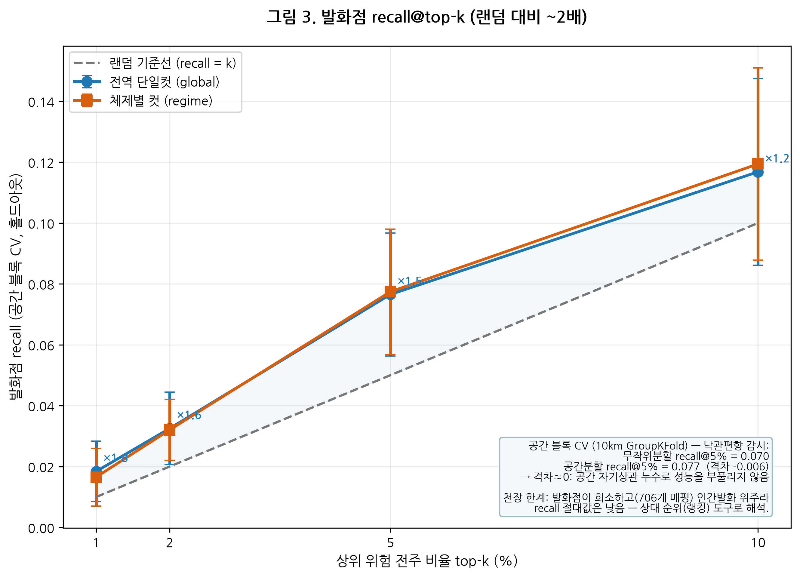

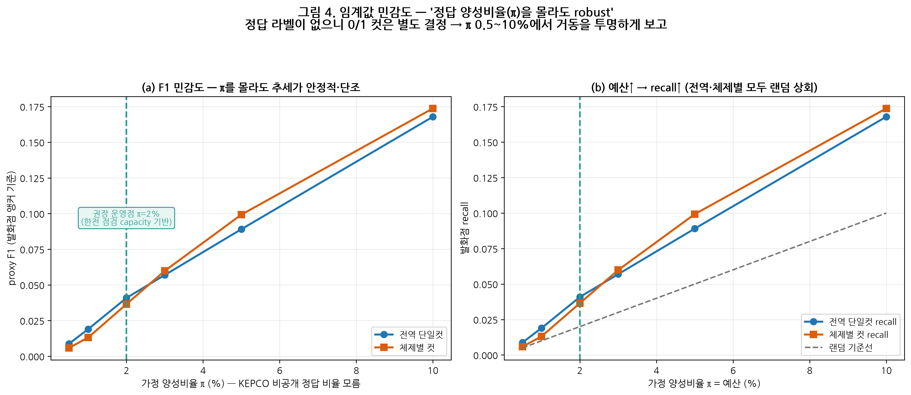

**(E) 전력설비 피처 기여·발화원인별 검증(LOGO ablation).** 본 과제가 *전력설비 인근* 위험인 만큼, 전력자산 피처의 실제 기여를 별도 검증했다(S·W·게이트·앵커·블록 고정, 발화성향 I의 피처셋만 교체; 공간블록 CV recall 가중목적, 부트스트랩 B=2000).
- **자산-인지 ablation**: blind(전력피처 미포함) 0.0878 → aware(+송전선거리) **0.0907** → plus(+변전소거리) 0.0866. 송전선거리는 약한 양(+)의 기여이나 전 구간 부트스트랩 신뢰구간이 0을 포함해 통계적 유의차는 아니며, 변전소는 오히려 악화 — **송전선거리만 채택·변전소 제외**(채택 가중 `feat_keys`와 일치). 전력설비 신호는 존재하되 약하다는 정직한 결과.
- **발화원인별 recall**(상대비교 전용; 설비발화 n≈18 희소·train/test 분할 없음 → 절대성능 아님): 설비발화(grid) recall@top10% 0.167로 지배적 인적발화(human, n=476) 0.151 이상 — 모델이 설비발화를 최소한 인적발화만큼은 포착한다. 2019 고성 산불은 FFAS 원인필드가 *'특고압 전선 아크 불티'*로 기록된 설비발화 사례이며 최근접 가상전주(0.32 km)에 매핑된다.

**(F) 불확실성 캘리브레이션.** 사후 구간이 명목 90%를 실제로 포함하는지 홀드아웃 발화점으로 점검했다. 분포가정 없는 체제별 conformal 실측 커버리지는 0.89로 명목±3%p 합격대에 들고, 베이지안 credible은 1.00으로 보수적(과대포함)이다 — 두 구간 모두 명목 보장을 충족한다(그림 11). 각 fold의 train 발화점만으로 임계·사후를 추정해 test 누수를 차단했다.

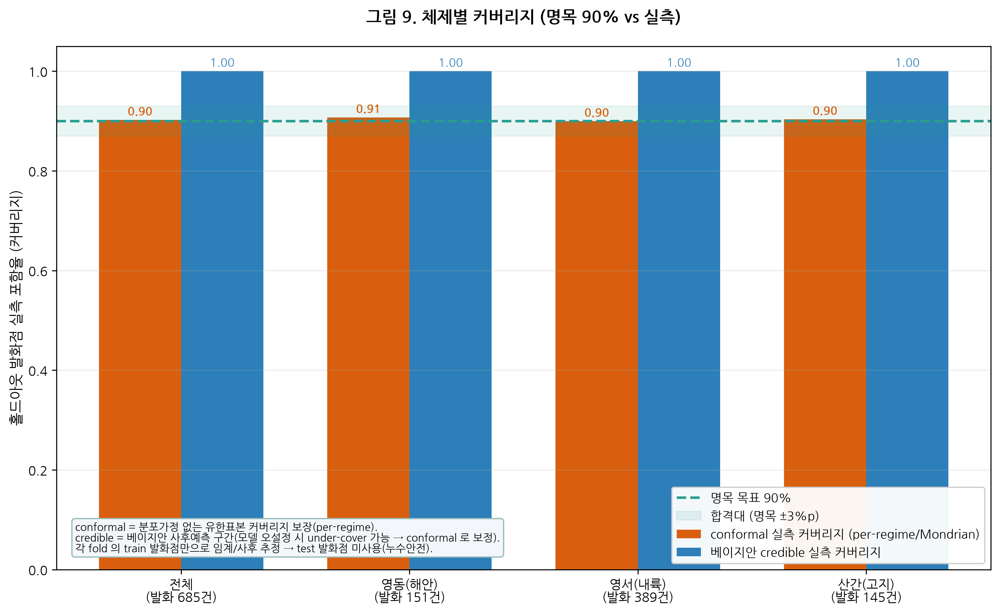

**(G) 최종 제출.** `접수번호.csv` — 필수 4컬럼(`pole_id, lon, lat, decision`) 제출본. 양성 27,757본(2.0%), 레짐별 배분 영동 3,827·회랑 2,417·영서 15,712·산악 5,801. 강원 전역의 위험 백분위와 고위험 판정 분포는 그림 12와 같다.

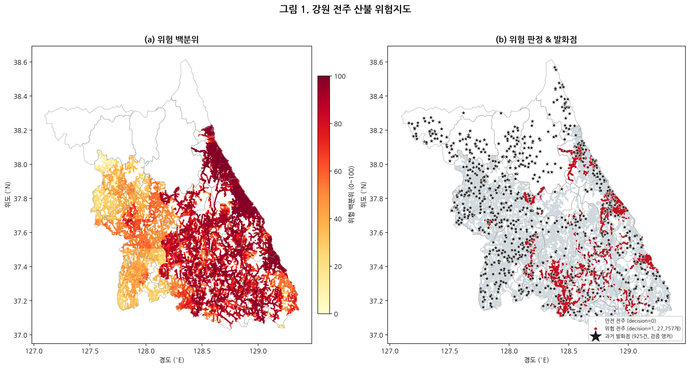

---

## 5. 활용방안

**(1) 점검·보강 우선순위.** 위험 2% 전주(레짐별 배분)를 현장 순시·설비 보강 우선 대상으로 둔다. 레짐별 배분으로 영서·산악도 지역 내 고위험 전주를 포함하여 강원 전역 운영이 가능하다(그림 13).

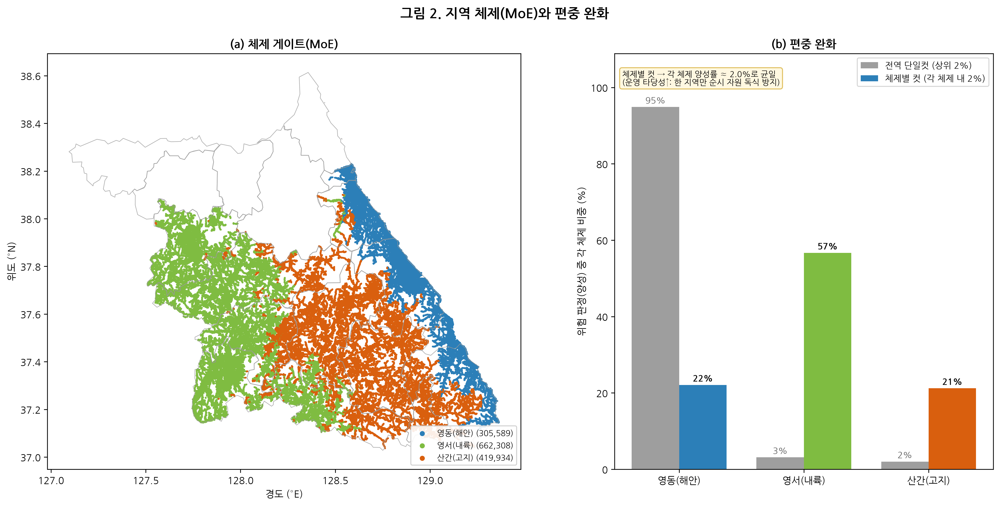

**(2) 레짐별 운영전략.** 발화 메커니즘에 따라 자원 배분을 구분한다.
- 영동·회랑: 발화기상 예보 연동. 양간지풍·FWI 경보일에 회랑(양양–고성) 송전선 집중 감시.
- 영서: 상시 순찰·인적요인 관리(주말·소각철 접근성 높은 구간).
- 산악: 도로변 접근 발화 대비.

**(3) 불확실성 동반 의사결정.** 제출 decision과 별도의 운영·해석용 산출물로 사후 신뢰구간(risk_lo/hi)을 제공한다. 위험이 높고 불확실성이 큰 전주(발화 희소·소표본 레짐)는 추가 관측·현장 확인으로, 위험이 높고 확실한 전주는 즉시 조치로 분기한다(그림 14).

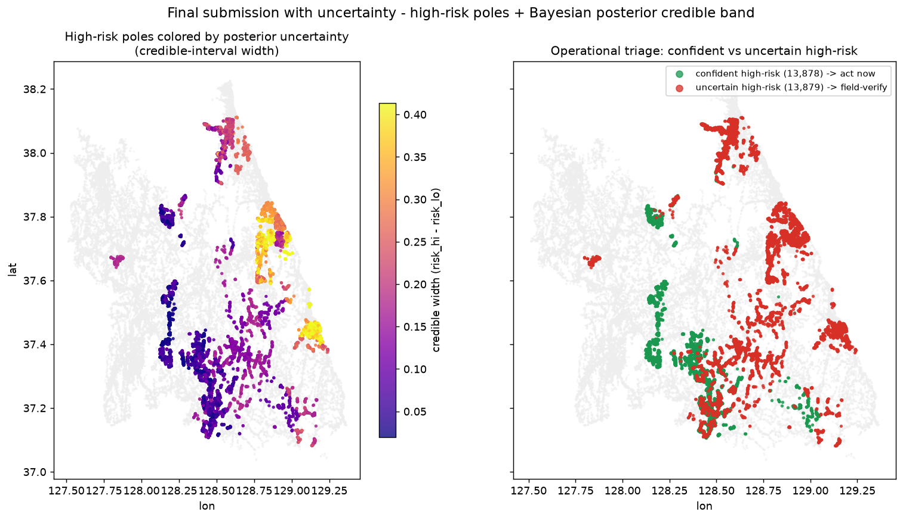

**(4) 확장.** 일별 FWI·양간지풍 예보와 연동하면 정적 우선순위를 일 단위 동적 경보로 전환할 수 있다.
